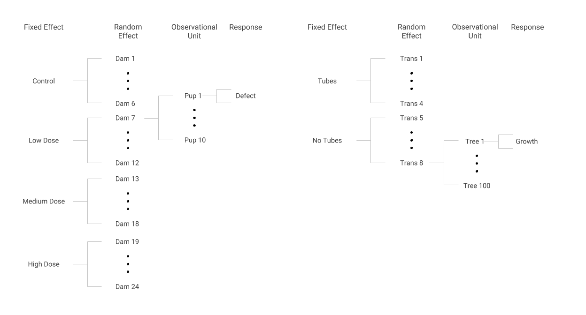

# Correlated Data {#ch-corrdata}

## Learning Objectives 
After finishing this chapter, you should be able to:

- Given a data structure, recognize when there is potential for correlation.
- Identify observational units at varying levels.
- Provide reasons why correlated observations may cause problems when modeling if they are not addressed.
- Describe overdispersion and why it might occur.
- Understand how correlation in data can be taken into account using random effects models.
- Describe differences in the kind of inferences that can be made using fixed versus random effects models.
- Use software to fit a model taking correlation into account.

```{r load_packages7, message = FALSE}
# Packages required for Chapter 7
library(gridExtra)
library(knitr)
library(kableExtra)
library(lme4)
library(ICC)
library(knitr)
library(tidyverse)
```

```{r,include=F}
if(knitr::is_html_output()){options(knitr.table.format = "html")} else {options(knitr.table.format = "latex")}
```

## Introduction

Introductory statistics courses typically require responses which are approximately normal and independent of one another. We saw from the first chapters in this book that there are models for non-normal responses, so we have already broadened the types of applications we can handle. In this chapter, we relax an additional assumption from introductory statistics, that of independence.  Here we introduce methods that allow correlation to be taken into account. When modeling, correlation can be considered for normal and non-normal responses. Taken together, we can handle many more applications than the average introductory student.

In this chapter, we first focus on recognizing data structures that may imply correlation, introducing new terminology for discussing correlated data and its effects.  Next, we consider potential problems correlated outcomes may cause and why we need to take correlation into account when modeling. Models which take correlation into account are then described and fit with the help of R.

This chapter will feel different than other chapters in this book.  In order to understand correlated data and contrast it with independent observations, we will be exploring several simulations and associated thought questions.  In that way, you should develop a feel for correlated data which will carry through into the remaining chapters to this book.  In addition, as you proceed through the simulations, fill out Table \@ref(tab:simulationTableCh7); this will help you see patterns as you compare analyses which account for correlation with those that do not.

```{r, simulationTableCh7, echo=FALSE}
#### one large table
tScenario <- c("1a", "", "1b", "", "",
                "Scenario","2a", "", "2b", "")

tModel <- c("Binomial", "Quasibinomial", "Binomial", "Quasibinomial", "",
            "Model", "Binomial", "Quasibinomial", "Binomial", "Quasibinomial")

#tModelName <- ifelse(knitr::is_html_output(),
#                     c("fit_1a_binom", "fit_1a_quasi", #"fit_1b_binom", "fit_1b_quasi", "", "Model Name", 
#                       "fit_2a_binom","fit_2a_quasi", #"fit_2b_binom", "fit_2b_quasi"),
#                     c("fit\\_1a\\_binom", #"fit\\_1a\\_quasi","fit\\_1b\\_binom","fit\\_1b\\_quasi", "", 
#                       "Model Name", #"fit\\_2a\\_binom","fit\\_2a\\_quasi", "fit\\_2b\\_binom", #"fit\\_2b\\_quasi"))

tModelName <- c("fit\\_1a\\_binom", "fit\\_1a\\_quasi", "fit\\_1b\\_binom", "fit\\_1b\\_quasi", " ", 
                       "Model Name", "fit\\_2a\\_binom","fit\\_2a\\_quasi", "fit\\_2b\\_binom", "fit\\_2b\\_quasi")

tBeta <- c("","","","","",
           "$\\beta_1$", "","","","")
tSEBeta <- c("","","","","",
           "SE $\\beta_1$", "","","","")
tTStat <- c("","","","","",
           "$t$", "","","","")
tPVal <- c("","","","","",
           "p value", "","","","")
tPhi <- c("","","","","",
           "$\\phi$", "","","","")
tEst <- c("","","","","",
           "Est odds ratio", "","","","")
tCI <- c("","","","","",
           "CI odds ratio", "","","","")
tMeanCount <- c("","X","","X","",
           "Mean count Dose=1", "","X","","X")
tSDCount <- c("","X","","X","",
           "SD count Dose=1", "","X","","X")
tGOFP <- c("","X","","X","",
           "GOF p value", "","X","","X")

scenarioSimTab <- tibble(tScenario, tModel, tModelName, tBeta, tSEBeta, tTStat, tPVal, tPhi, tEst, tCI, tMeanCount, tSDCount, tGOFP)
colnames(scenarioSimTab) <- c("Scenario", "Model", "Model Name", "$\\beta_0$", "SE $\\beta_0$", "$t$", "p value", "$\\phi$", "Est prob", "CI prob", "Mean count", "SD count", "GOF p value")

kable(scenarioSimTab, booktabs=T, caption="Summary of simulations for Dams and Pups case study", escape=F) %>%
  kable_styling(latex_options = "scale_down") %>%
  row_spec(6, bold=T) %>%
  column_spec(9:13, width = "5em")
```


## Recognizing correlation

Correlated data is encountered in nearly every field. In education, student scores from a particular teacher are typically more similar than scores of other students who have had a different teacher. During a study measuring depression indices weekly over the course of a month, we usually find that four measures for the same patient tend to be more similar than  depression indices from other patients. In political polling, opinions from members of the same household are usually more similar than opinions of members from other randomly selected  households. The structure of these data sets suggest inherent patterns of similarities or correlation among outcomes. This kind of correlation specifically concerns correlation of observations *within the same teacher or patient or household* and is referred to as __intraclass correlation__.

Correlated data often takes on a multilevel structure.  That is, population elements are grouped into aggregates, and we often have information on both the individual elements and the aggregated groups.  For instance, students are grouped by teacher, weekly depression measures are grouped by patient, and survey respondents are grouped by household.  In these cases, we refer to **levels** of measurement and observational units at each level.  For example, students might represent **level one observational units** while teachers represent **level two observational units**, where **level one** is the most basic level of observation, and level one observations are aggregated to form **level two** observations.  Then, if we are modeling a response such as test score, we may want to examine the effects of student characteristics such as sex and ethnicity, and teacher characteristics such as years of experience.  Student characteristics would be considered **level one covariates**, while teacher characteristics would be **level two covariates**.


## Case Study: Dams and pups
A __teratogen__ is a substance or exposure that can result in harm to a developing fetus. An experiment can be conducted to determine whether increasing levels of a potential teratogen results in increasing probability of defects in rat pups.  We will simulate the results of an experiment in which 24 dams (mother rats) are randomized to four groups: 3 groups of 6 dams each are administered a potential teratogen in high (3mg), medium (2mg), or low (1mg) doses, and the fourth group serves as the control.  Each of the 24 dams produces 10 rat pups, and each pup is examined for the presence of an anomaly or deformity.  

## Sources of Variability
Before we analyze data from our simulated experiment, let's step back and look at the big picture. Statistics is all about analyzing and explaining variability, so let's consider what sources of variability we have in the dams and pups example. There are several reasons why the counts of the number of defective pups might differ from dam to dam, and it is helpful to explicitly identify these reasons in order to determine how the dose levels affect the pups while also accommodating correlation.

__Dose Effect__ The dams and pups experiment is being carried out to determine whether different dose levels affect the development of defects differently. Of particular interest is determining whether a **dose-response** effect is present. A dose-response effect is evident when dams receiving higher dose levels produce higher proportions of pups with defects. Knowing defect rates at specific dose levels is typically of interest within this experiment and beyond. Publishing the defect rates for each dose level in a journal paper, for example, would be of interest to other teratologists. For that reason, we refer to dose level effects as __fixed effects__.

__Dams (Litter) Effect__  In many settings like this, there is a litter effect as well. For example, some dams may exhibit a propensity to produce pups with defects while others rarely produce litters with defective pups. That is, observations on pups within the same litter are likely to be similar or correlated. Unlike the dose effect, teratologists reading experiment results are not interested in the estimated probability of defect for each dam in the study, and we would not report these estimated probabilities in a paper. However, there may be interest in the *variability* in litter-specific defect probabilities; accounting for dam-to-dam variability reduces the amount of unexplained variability and leads to more precise estimates of fixed effects like dose. Often this kind of effect is modeled using the idea that randomly selected dams produce __random effects__. This provides one way in which to model correlated data, in this case the correlation between pups from the same dam. We elaborate on this idea throughout the remainder of the text.

__Pup-to-pup variability__ The within litter pup-to-pup differences reflect random, unexplained variation in the model.

## Scenario 1: No covariates

In Scenario 1, we will ignore dose and assume that dose has no effect on the probability of a deformed pup.  You can follow along with the simulation (and modify it as desired) in the *Rmd* file for this chapter (note that some lines of code are run but not printed in the chapter text), and fill out Table \@ref(tab:simulationTableCh7).

First, we will consider Scenario 1a where each dam's probability of producing a deformed pup is $p = 0.5$; thus, each dam's log odds are 0.  We then will compare this to Scenario 1b, where dams' probabilities of producing a deformed pup follow a beta distribution where $\alpha = \beta = 0.5$ (which has expected value $0.5$).  So, in Scenario 1b, each dam has a different probability of producing a deformed pup, but the probabilities average out to 0.5, whereas in Scenario 1a each dam has an identical probability of producing a deformed pup (0.5).  Figure \@ref(fig:scenario1ProbabilityPlot) illustrates these two scenarios; every dam in Scenario 1a has a probability of 0.5 (at the red line), while probabilities in Scenario 1b are selected from the black dashed distribution, so that probabilities near 0 and 1 are more likely than probabilities near 0.5.  The histogram shows 24 randomly generated probabilities under one run of Scenario 1b.

The R code below produces a simulated number of deformed pups for each of the 24 dams under Scenario 1a and Scenario 1b, and Figure \@ref(fig:scenario1Plot) displays distributions of counts of deformed pups per dam for the two simulations. In Scenario 1a, the mean number of deformed pups is 5.17 with standard deviation 1.49. In Scenario 1b, the mean number of deformed pups is 5.67 with standard deviation 4.10. 

```{r ch7Seed, include = FALSE}
set.seed(2)  # to get the same simulated results as reported here
```

```{r damScenario1, message=FALSE}
pi_1a <- rep(0.5, 24)
count_1a <- rbinom(24, 10, pi_1a)

pi_1b <- rbeta(24,.5,.5)  
count_1b <- rbinom(24, 10, pi_1b)  
```

```{r scenario1ProbabilityPlot, fig.align="center",out.width="60%",fig.cap= "Dam Probabilities in Scenario 1", echo=FALSE, warning=FALSE, message=FALSE}
theoretical_pi <- tibble(x = 1:250000,
                         p1 = rbeta(x, 0.5, 0.5))

tibble(x = 1:24, pi_1b) %>%
  ggplot() +
    geom_histogram(bins = 5, aes(x = pi_1b, y = ..density..),
                   color = "black", fill = "white") + 
    coord_cartesian(xlim = c(0,1)) +
    geom_density(data = theoretical_pi, aes(x = p1), 
                 bw = 0.025, linetype = 3) +
    geom_vline(xintercept = 0.5, color = "red", linetype = 2) +
    labs(title = "", x = "Probability of Deformity")
```


```{r, scenario1Plot, fig.align="center",out.width="60%",fig.cap= "Counts of deformed pups per dam under Scenarios 1a and 1b", echo=FALSE, warning=FALSE, message=FALSE}
scenario_1 <- tibble(pi_1a, count_1a, pi_1b, count_1b) %>%
  mutate(phat_1a = count_1a / 10, phat_1b = count_1b / 10)

hist_1a <- ggplot(data = scenario_1, aes(x = count_1a)) + 
  geom_histogram(bins = 5, color = "black", fill = "white") +
  coord_cartesian(xlim = c(0, 10)) +
  labs(title = "Scenario 1a: Binomial, p = 0.5",
       x = "Count of deformed pups per dam")

hist_1b <- ggplot(data = scenario_1, aes(x = count_1b)) + 
  geom_histogram(bins = 5, color = "black", fill = "white") +
  coord_cartesian(xlim = c(0, 10)) +
  labs(title = "Scenario 1b: Binomial, p ~ Beta(0.5, 0.5)",
       x = "Count of deformed pups per dam")

grid.arrange(hist_1a, hist_1b, ncol=1)
```

```{r scenario1Summary, include=FALSE}
scenario_1 %>% 
  summarise(mean_1a = mean(count_1a), sd_1a = sd(count_1a),
            mean_1b = mean(count_1b), sd_1b = sd(count_1b) )
```

**Thought Questions**

1. Will the counts of deformed pups for dams in Scenario 1a behave like a binomial distribution with $n=10$ and $p=0.5$ (that is, like counting heads in 10 flips of a fair coin)?  Why or why not?

2. Will the counts of deformed pups for dams in Scenario 1b behave like a binomial distribution with $n=10$ and $p=0.5$ (that is, like counting heads in 10 flips of a fair coin)?  If not, extend the coin flipping analogy to Scenario 1b.

3. Is Scenario 1b realistic?  Why might some dams have higher probabilities than others?

If we were to model the number of deformed pups per dam in Scenario 1a, we could ignore the potential of a dam effect (since all dams behave the same) and proceed with regular binomial regression as in Chapter \@ref(ch-logreg). Since we have no predictors, we would start with the model:

\begin{equation*}
  \log \bigg( \frac{\hat{p}}{1-\hat{p}} \bigg) = \hat{\beta}_0, \textrm{ where } \hat{\beta}_0 = 0.067
\end{equation*}
which produces an estimated odds of deformity $\widehat{p}/(1-\widehat{p}) = e^{0.067} = 1.069$ and estimated probability $\widehat{p} = 0.517$. Creating 95\% confidence intervals using a profile likelihood approach, we get:

(ref:CI) 95% CI for

\[
\begin{alignedat}{2}
  &\textrm{(ref:CI) } p/(1-p) &&= (0.830, 1.378) \\
  &\textrm{(ref:CI) } p       &&= (0.454, 0.579)
\end{alignedat}
\]

```{r scenario1aBinom, include=FALSE}
fit_1a_binom <- glm(phat_1a ~ 1, family=binomial, weight=rep(10,24), data = scenario_1)
summary(fit_1a_binom) 
# estimated odds of deformity
exp(coef(fit_1a_binom)) 
# estimated prob of deformity
exp(coef(fit_1a_binom)) / (1+exp(coef(fit_1a_binom)))   

confint(fit_1a_binom)                                
exp(confint(fit_1a_binom))
exp(confint(fit_1a_binom)) / (1 + exp(confint(fit_1a_binom)))
```

```{r scenario1aQuasi, include=FALSE}
fit_1a_quasi = glm(phat_1a ~ 1, family=quasibinomial, weight=rep(10,24), data=scenario_1)
summary(fit_1a_quasi) 
# estimated odds of deformity
exp(coef(fit_1a_quasi)) 
# estimated prob of deformity
exp(coef(fit_1a_quasi)) / (1+exp(coef(fit_1a_quasi)))   

confint(fit_1a_quasi)                                
exp(confint(fit_1a_quasi))
exp(confint(fit_1a_quasi)) / (1 + exp(confint(fit_1a_quasi)))
```

However, we can account for potential overdispersion with a __quasibinomial model__, just as we did in Section \@ref(sec-logOverdispersion), in case the observed variance is larger than the variance under a binomial model.  Quasibinomial regression yields the same estimate for $\beta_0$ as the binomial regression model ($\hat{\beta}_0 = 0.067$), but we now have overdispersion paramater $\widehat{\phi} = 0.894$.  This gives us the following 95\% profile likelihood-based confidence intervals:

\[
\begin{alignedat}{2}
  &\textrm{(ref:CI) } p/(1-p) &&= (0.841, 1.359) \\
  &\textrm{(ref:CI) } p       &&= (0.457, 0.576)
\end{alignedat}
\]

Turning to Scenario 1b, where each dam has a unique probability of producing a pup with a deformity based on a beta distribution, we can fit binomial and quasibinomial models as well.

```{r scenario1bBinom, include=FALSE}
fit_1b_binom <- glm(phat_1b ~ 1, family=binomial, weight=rep(10,24), data = scenario_1)
summary(fit_1b_binom) 
# estimated odds of deformity
exp(coef(fit_1b_binom)) 
# estimated prob of deformity
exp(coef(fit_1b_binom)) / (1+exp(coef(fit_1b_binom)))   

confint(fit_1b_binom)                                
exp(confint(fit_1b_binom))
exp(confint(fit_1b_binom)) / (1 + exp(confint(fit_1b_binom)))
```

A binomial model gives regression equation

\begin{equation*}
  \log\bigg(\frac{\hat{p}}{1-\hat{p}}\bigg) = 0.268,
\end{equation*}
with associated profile likelihood 95\% confidence intervals:

\[
\begin{alignedat}{2}
  &\textrm{(ref:CI) } p/(1-p) &&= (1.014, 1.691) \\
  &\textrm{(ref:CI) } p       &&= (0.504, 0.628)
\end{alignedat}
\]

```{r scenario1bQuasi, include=FALSE}
fit_1b_quasi = glm(phat_1b ~ 1, family=quasibinomial, weight=rep(10,24), data=scenario_1)
summary(fit_1b_quasi) 
# estimated odds of deformity
exp(coef(fit_1b_quasi)) 
# estimated prob of deformity
exp(coef(fit_1b_quasi)) / (1+exp(coef(fit_1b_quasi)))   

confint(fit_1b_quasi)                                
exp(confint(fit_1b_quasi))
exp(confint(fit_1b_quasi)) / (1 + exp(confint(fit_1b_quasi)))
```

We could compare this to a quasibinomial model. With overdispersion paramater $\widehat{\phi} = 6.858$, we now have profile likelihood-based intervals:

\[
\begin{alignedat}{2}
  &\textrm{(ref:CI) } p/(1-p) &&= (0.673, 2.594) \\
  &\textrm{(ref:CI) } p       &&= (0.402, 0.722)
\end{alignedat}
\]

**Thought Questions**

4. Describe how the quasibinomial analysis of Scenario 1b differs from the binomial analysis of the same simulated data.  Refer to Table \@ref(tab:simulationTableCh7) when answering this question; you will need to run the R code in the R markdown file for this chapter to completely fill out the table.  Do confidence intervals contain the true model parameters? 

5. Why are differences between quasibinomial and binomial models of Scenario 1a less noticeable than the differences in Scenario 1b?


## Scenario 2: Dose effect

In Scenario 1, each dam's probability of producing a deformed pup was independent of their dosage of the teratogen. In Scenario 2 we allow for a dose effect. To recall, in this hypothetical experiment we have 24 total dams evenly split into 4 groups recieving either no dose (coded as `dose = 0` mg), a low dose (`dose = 1`), a medium dose (`dose = 2`), or a high dose (`dose = 3`) of the teratogen.

We will suppose that true probability that a dam's pup has a deformity is related to the dose the dam received through this model:

\[ \log \bigg(\frac{p}{1-p} \bigg) = -2 + 1.33\; \textrm{dose} \]
That is, we assume that the log odds of a deformity is linearly related to dose through the equation above, and the odds of a deformity are 3.79 times greater ($e^{1.33}$) for each 1mg increase in dose.

In Scenario 2a, a dam who received a dose of $x$ would have probability

\[p = P(\textrm{deformity}\mid \textrm{dose} = x) = e^{-2+1.33x}/(1+e^{-2+1.33x}). \]
Thus, dams who received doses of 0, 1, 2, and 3 mg would have probabilities 0.12, 0.34, 0.66, and 0.88, respectively, under Scenario 2a.  
```{r secnario2aPCalculations, include=FALSE}
x <- 0:3
p_2 <- exp(-2+4/3*x)/(1+exp(-2+4/3*x))
p_2
```

In Scenario 2b, each dam who received a dose of $x$ has probability of deformity randomly chosen from a beta distribution where $\alpha = 2p/(1-p)$ and $\beta = 2$. These beta distribution parameters ensure that, on average, dams with a dose $x$ in Scenario 2b have the same probability of a deformed pup as dams with dose $x$ in Scenario 2a.  For example, dams receiving the 1mg dosage under Scenario 2b would have probabilities following a beta distribution with $\alpha = 2(0.34)/(1-0.34) = 1.03$ and $\beta = 2$, which has mean $\frac{\alpha}{\alpha + \beta}=0.34$.  The big difference is that *all* dams receiving the 1mg dosage in Scenario 2a have probability 0.34 of a deformed pup, whereas dams receiving the 1mg dosage in Scenario 2b each have a unique probability of a deformed pup, but those probabilities average out to 0.34.

Figure \@ref(fig:scenario2bPlot) displays histograms for each dosage group of each  dam's probability of producing deformed pups under Scenario 2b as well as theoretical distributions of probabilities. A vertical line is displayed at each hypothetical distribution's mean; the vertical line represents the fixed probability of a deformed pup for all dams under Scenario 2a. 

```{r damScenario2, message=FALSE}
set.seed(1)

dose <- c(rep(0,6),rep(1,6),rep(2,6),rep(3,6))

pi_2a <- exp(-2+4/3*dose)/(1+exp(-2+4/3*dose))
count_2a <- rbinom(24, 10, pi_2a)

b <- 2
a <- b*pi_2a / (1-pi_2a)
pi_2b <- rbeta(24, a, b)
count_2b <- rbinom(24, 10, pi_2b)  
```

```{r, scenario2bPlot, fig.align="center",out.width="60%",fig.height=8.5,fig.cap= "Observed (histograms) and theoretical (density curves) distributions of dams' probabilities of producing deformed pups by dose group in Scenario 2b.  The red vertical line represents the fixed probability of a deformed pup by dose group in Scenario 2a.", echo=FALSE, warning=FALSE, message=FALSE}
scenario_2 <- tibble(dose, pi_2a, count_2a, pi_2b, count_2b)
theoretical_pi <- tibble(x = 1:50000,
  p1 = rbeta(x, shape1 = 2*p_2[1]/(1-p_2[1]), shape2 = 2),
  p2 = rbeta(x, shape1 = 2*p_2[2]/(1-p_2[2]), shape2 = 2),
  p3 = rbeta(x, shape1 = 2*p_2[3]/(1-p_2[3]), shape2 = 2),
  p4 = rbeta(x, shape1 = 2*p_2[4]/(1-p_2[4]), shape2 = 2))

hist1 <- ggplot() + 
  geom_histogram(data = scenario_2[1:6,], bins = 5, 
                 aes(x = pi_2b, y = ..density..),
                 color = "black", fill = "white") + 
  coord_cartesian(xlim = c(0,1)) +
  geom_density(data = theoretical_pi, aes(x = p1), 
               bw = 0.05, linetype = 3) +
  #stat_function(fun = dbeta,
  #              args = list(shape1 = 2*0.119/(1-0.119), shape2 = 2),
  #              xlim = c(0.01,1)) +
  geom_vline(xintercept = p_2[1], color = "red", linetype = 2) +
  labs(title = "Dosage = 0mg", x = "Probability of Deformity")
  

hist2 <- ggplot() + 
  geom_histogram(data = scenario_2[7:12,], 
                 aes(x = pi_2b, y = ..density..), bins = 5,
                 color = "black", fill = "white") +
  coord_cartesian(xlim = c(0,1)) +
  geom_density(data = theoretical_pi, aes(x = p2), 
               bw = 0.05, linetype = 3) +
  geom_vline(xintercept = p_2[2], color = "red", linetype = 2) +
  labs(title = "Dosage = 1mg", x = "Probability of Deformity")

hist3 <- ggplot() + 
  geom_histogram(data = scenario_2[13:18,], 
                 aes(x = pi_2b, y = ..density..), bins = 5,
                 color = "black", fill = "white") +
  coord_cartesian(xlim = c(0,1)) +
  geom_density(data = theoretical_pi, aes(x = p3), 
               bw = 0.05, linetype = 3) +
  geom_vline(xintercept = p_2[3], color = "red", linetype = 2) +
  labs(title = "Dosage = 2mg", x = "Probability of Deformity")

hist4 <- ggplot() + 
  geom_histogram(data = scenario_2[19:24,], 
                 aes(x = pi_2b, y = ..density..), bins = 5,
                 color = "black", fill = "white") +
  coord_cartesian(xlim = c(0,1)) +
  geom_density(data = theoretical_pi, aes(x = p4), 
               bw = 0.05, linetype = 3) +
  geom_vline(xintercept = p_2[4], color = "red", linetype = 2) +
  labs(title = "Dosage = 3mg", x = "Probability of Deformity")

grid.arrange(hist1, hist2, hist3, hist4, ncol=1)
```

```{r scenario2Summary, include=FALSE, message=FALSE}
scenario_2 %>% 
  summarise(mean_2a = mean(count_2a), sd_2a = sd(count_2a),
            mean_2b = mean(count_2b), sd_2b = sd(count_2b) )
```

```{r scenario2Tab, echo=FALSE, message=FALSE}
scenario2Tab <- scenario_2 %>%
                  group_by(dose) %>%
                  summarise(mean_2a_pi = round(mean(pi_2a),3), sd_2a_pi = round(sd(pi_2a),3),
                            mean_2a_cnt = round(mean(count_2a),3), sd_2a_cnt = round(sd(count_2a),3),
                            mean_2b_pi = round(mean(pi_2b),3), sd_2b_pi = round(sd(pi_2b),3),
                            mean_2b_cnt = round(mean(count_2b),3), sd_2b_cnt = round(sd(count_2b),3)) %>%
                  as.data.frame()
colnames(scenario2Tab) <- c("Dosage","Mean p", "SD p",
    "Mean Count", "SD Count", "Mean p", "SD p",
    "Mean Count", "SD Count")
kable(scenario2Tab, booktabs = T, 
    caption="Summary Statistics of Scenario 2 by Dose") %>%
    add_header_above(c(" " = 1, "Scenario 2a" = 4, 
                       "Scenario 2b" = 4)) %>%
    kable_styling(latex_options = "scale_down") %>%
    column_spec(c(4:5,8:9), width = "1cm")
```

**Thought Questions**

6. Compare and contrast the probabilities associated with the 24 dams under Scenarios 1a and 1b to the probabilities under Scenarios 2a and 2b. 

7. In Scenario 2a, dams produced 4.79 deformed pups on average, with standard deviation 3.20.  Scenario 2b saw an average of 4.67 with standard deviation 3.58.  Explain why comparisons by dose are more meaningful than these overall comparisons.  You might refer to the results in Table \@ref(tab:scenario2Tab). 

8. In Table \@ref(tab:simulationTableCh7), predict what you'll see in the column headed "CI_odds_ratio".  Among the 4 entries: What can you say about the center and the width of the confidence intervals?  Which will be similar and why?  Which will be different and how?

We first model Scenario 2a without adjusting for potential overdispersion. Binomial regression gives us the model:

\begin{equation}
  \log\bigg( \frac{\hat{p}}{1-\hat{p}} \bigg) = -2.02 + 1.26\;\textrm{dose}
  (\#eq:mod2aBinom)
\end{equation}
Equation \@ref(eq:mod2aBinom) has associated odds ratio corresponding to a 1mg dose increase of $e^{\beta_1} = 3.54$ with 95\% profile likelihood confidence interval $(2.61, 4.96)$.  We can be 95\% confident that odds of deformity are between 2.61 and 4.96 times higher for each 1 mg increase in dose.

```{r scenario2aBinom, include=FALSE}
scenario_2 <- scenario_2 %>%
  mutate(dose = dose,
         phat_2a = count_2a / 10, phat_2b = count_2b / 10,
      logit_2a = log ((count_2a + 0.5) / (10 - count_2a + 0.5)),
      logit_2b = log ((count_2b + 0.5) / (10 - count_2b + 0.5)) )

fit_2a_binom = glm(phat_2a ~ dose, family=binomial, weight=rep(10,24), data=scenario_2)
summary(fit_2a_binom)
exp(confint(fit_2a_binom))
```

Alternatively, we can use a quasibinomial model to account for any overdispersion in the binomial model. With $\widehat{\phi} = 1.27$, we have the 95\% profile likelihood confidence interval for $e^\beta_1$: $(2.51, 5.19)$.

```{r scenario2aQuasi, include=FALSE}
fit_2a_quasi = glm(phat_2a ~ dose, family=quasibinomial, weight=rep(10,24), 
                   data=scenario_2)
summary(fit_2a_quasi) 
exp(confint(fit_2a_quasi))
```

Turning to Scenario 2b, where probabilities were different between dams recieving the same dosage, we have the binomial model

\begin{equation}
  \log\bigg( \frac{\hat{p}}{1-\hat{p}} \bigg) = -2.41 + 1.46\;\textrm{dose}
  (\#eq:mod2bBinom)
\end{equation}
Generating a 95\% confidence interval for $e^{\beta_1}$, we have: $(3.09, 6.27)$.
```{r scenario2bBinom, include=FALSE}
fit_2b_binom = glm(phat_2b ~ dose, family=binomial, weight=rep(10,24), data=scenario_2)
summary(fit_2b_binom) 
exp(confint(fit_2b_binom)) 
```

If we use a quasibinomial model, we find overdispersion paramater $\widehat{\phi} = 1.93$, yielding 95\% confidence interval for $e^{\beta_1}$: $(2.74, 7.35)$.

```{r scenario2bQuasi, include=FALSE}
fit_2b_quasi = glm(phat_2b ~ dose, family=quasibinomial,
                   weight=rep(10,24), data=scenario_2)
summary(fit_2b_quasi)
exp(confint(fit_2b_quasi)) 
```

**Thought Questions**

9. Describe how the quasibinomial analysis of Scenario 2b differs from the binomial analysis of the same simulated data.  Refer to Table \@ref(tab:simulationTableCh7) when answering this question; you will need to run the R code in the R markdown file for this chapter to completely fill out the table.  Do confidence intervals contain the true model parameters? 

10. Why are differences between quasibinomial and binomial models of Scenario 2a less noticeable than the differences in Scenario 2b?

11. Why does Scenario 2b contain correlated data that we must account for, while Scenario 2a does not?


## Case Study: Tree Growth

A student research team at St. Olaf College contributed to the efforts of biologist Kathy Shea to investigate a rich data set concerning forestation in the surrounding land. [@Eisinger2011]  Here is a paragraph from the introduction to their project report:

> Much of south-central Minnesota was comprised of maple-basswood forest prior to agricultural development and settlement. Currently, the forests that remain are highly fragmented and disturbed by human activities. Original land surveys describe the forest, also known as the Big Woods ecosystem, as dominated by elm, maple, oak, and basswood. In order to recover the loss of ecosystem services that forests provide, many new forested areas have been established through restoration.

Tubes were placed on trees in some locations or *transects* but not in others. One research question is whether tree growth in the first year is affected by the presence of tubes. This analysis has a structure similar to the dams and pups; the two study designs are depicted below.  



Some transects were assigned to have tubes on all of their trees and other transects had no tubes on all of their trees, just as every dam assigned to a certain group received the same dose.  Within a transect, each tree's first year of growth was measured, much like the presence or absence of a defect was noted for every pup within a dam. Although the response in the tree tube study is continuous (and somewhat normally distributed) rather than binary as in the dams and pups study, we can use methods to account for correlation of trees within a transect, just as we accounted for correlation of pups within dams. 

### Format of the data set

We will consider a subset of the full data set in `treetube.csv` for illustration purposes here: the 382 trees with heights recorded in both 1990 and 1991.  Thus, we will consider the following variables:

- `id` = a unique identifier for each tree
- `transect` = a unique identifier for each transect containing several trees
- `species` = tree species
- `tubes` = an indicator variable for the presence or absence of tubes for a given transect
- `height91` = first year height for each tree in meters
- `height90` = baseline height for each tree in meters
- `growth_yr1` = height91 - height90, in meters

A sample of 10 observations are displayed in Table \@ref(tab:treeTubeTab).

```{r treeTubesSetup, include=FALSE}
treetubes_yr1 <- read_csv("data/treetube.csv") %>%
  filter(YEAR == 1990 | YEAR == 1991) %>%
  spread(key = YEAR, value = HEIGHT) %>%
  mutate(growth_yr1 = `1991` - `1990`) %>%
  filter(!is.na(growth_yr1)) %>%
  rename(tubes = TUBEX, id = ID, transect = TRANSECT, 
         species = SPECIES,
         height91 = `1991`, height90 = `1990`) %>%
  dplyr::select(id, transect, species, tubes, height91, 
                height90, growth_yr1)
```

```{r treeTubeTab, echo=FALSE}
kable(treetubes_yr1[c(137:146),], booktabs = T, caption="A sample of 10 trees and their growth from 1990 to 1991")
```

This portion of the data indicates that the four trees in transect 18 have tubes, while the other six trees listed do not. The concern with this kind of data structure is that trees from the same transect may be more similar or correlated with one another in contrast to trees from other transects. This could be true for a variety of reasons: some transects may receive less sun than others, or irrigation of the soil may differ from transect to transect. These unmeasured but possibly influential factors may imply a correlation among trees within transects.  In that case, we would not have independent pieces of information, so that the number of trees within a transect would overstate the amount of independent information. To prepare for an analysis of this potentially correlated data, we examine the sources of variability in first-year tree growth.

### Sources of variability

First year tree growth may vary because of:

__Tube effects__ A purpose of this analysis is to determine whether tubes affect first year tube growth. Differences in mean growth based on the presence or absence of tubes would be of interest to researchers, and they would be included in a publication for this analysis. For this reason, tube effects are referred to as __fixed effects__. This is analogous to the dose effect in the dams and pups example.

__Transect effects__ For some of the factors previously mentioned such as sun exposure or water availability, first year growth may vary by transect. Knowing which specific transects produce greater growth is not of interest and would not appear in a publication of this study. These __random effects__ are analogous to dam effects which were not of inherent interest, but which we nevertheless wished to account for.

__Tree-to-tree variability within transects__ There is inherent variability in tree growth even when they are subject to the same transect and treatment effects. This variability remains unexplained in our model, although we will attempt to explain some of it with covariates such as species.


Data sets with this kind of structure are often referred to as __multilevel data__, and the remaining chapters delve into models for multilevel data in gory detail.  With a continuous response variable, we will actually add random effects for transects to a more traditional linear least squares regression model rather than estimate an overdispersion parameter as with a binary response.  Either way, if observations are really correlated, proper accounting will lead to larger standard errors for model coefficients and larger (but more appropriate) p-values for testing the significance of those coefficients.

### Analysis preview: accounting for correlation within transect

Attempting to model the effects of tubes on tree growth, we could use LLSR which yields the model:

\begin{equation}
  \hat{\textrm{Growth}} = 0.106 - 0.040\; \textrm{Tube}
\end{equation}

```{r, comment=NA}
tube_linear <- lm(growth_yr1 ~ tubes, data = treetubes_yr1)
```

```{r, echo=FALSE, message=FALSE}
coef(summary(tube_linear))
cat(" R squared = ", summary(tube_linear)$r.squared, "\n", 
    "Residual standard error = ", summary(tube_linear)$sigma)
```

However, the LLSR model assumes that all observations are independent, including trees in the same transect.  One way to account for potential correlation is to estimate an additional parameter for the transect-to-transect variance.  In other words, we are allowing for a random effect that each transect contributes to the overall variability.  The multilevel model below does just that.

```{r, comment=NA}
tube_multi1 <- lmer(growth_yr1 ~ tubes + (1|transect), 
                    data = treetubes_yr1)
```

```{r, echo=FALSE, message=FALSE}
coef(summary(tube_multi1))
VCrandom <- VarCorr(tube_multi1)
print(VCrandom, comp = c("Variance", "Std.Dev."))
```

Like we saw in the case of the binary outcomes, the standard error for the coefficients is larger when we take correlation into account. The t-statistic for tubes is smaller, reducing our enthusisam for the tubes effect. This conservative approach occurs because the observations within a transect are correlated and therefore not independent as assumed in the naive model. We will study these models in depth in the remaining chapters.

## Summary
The most important idea from this chapter is that structures of data sets may imply that outcomes are correlated. Correlated outcomes provide less information than independent outcomes, resulting in effective sample sizes that are less than the total number of observations. Neglecting to take into account correlation may lead to underestimating standard errors of coefficients, overstating significance and precision.  Correlation is likely and should be accounted for if basic observational units (e.g., pups, trees) are aggregated in ways that would lead us to expect units within groups to be similar.

We have mentioned two ways to account for correlation: incorporate a dispersion parameter or include random effects.  In the following chapters we will primarily focus on models with random effects.  In fact, there are even more ways to account for correlation, including inflating the variance using Huber-White estimators (aka Sandwich estimators), and producing corrected variances using bootstrapping. These are beyond the scope of this text.


## Exercises

### Conceptual Exercises

1. __Examples with Correlated Data__ For each of the following studies: 
    - Identify the most basic observational units
    - Identify the grouping units (could be multiple levels of grouping)
    - State the response(s) measured and variable type (normal, binary, Poisson, etc.)
    - Write a sentence describing the within-group correlation.
    - Identify fixed and random effects

a. *Nurse Stress Study.*  Four wards were randomly selected at each of 25 hospitals and randomly assigned to offer a stress reduction program for nurses on the ward or to serve as a control.  At the conclusion of the study period, a random sample of 10 nurses from each ward completed a test to measure job-related stress.  Factors assumed to be related include nurse experience, age, hospital size and type of ward.

b. *Epilepsy Study.*  Researchers conducted a randomized controlled study where patients were randomly assigned to either an anti-epileptic drug or a placebo.  For each patient, the number of seizures at baseline was measured over a 2 week period.  For four consecutive visits the number of seizures were determined over the past 2 week period. Patient age and sex along with visit number were recorded.

c. *Cockroaches!*  For a study of cockroach infestation, traps were set up in the kitchen, bathroom, and bedroom in a random sample of 100 New York City apartments. The goal is to estimate cockroach infestation levels given tenant income and age of the building.

d. *Prairie Restoration.*  Researchers at a small Midwestern college decided to experimentally explore the underlying causes of variation in soil reconstruction projects in order to make future projects more effective. Introductory ecology classes were organized to collect weekly data on plants in pots containing soil samples. Data will be examined to compare:
    - germination and growth of two species of prairie plants—--leadplants (*Amorpha canescens*) and coneflowers (*Ratibida pinnata*)
    - soil from a cultivated (agricultural) field, a natural prairie, and a restored (reconstructed) prairie.
    - the effect of sterilization, since half of the sampled soil was sterilized to determine if rhizosphere differences were responsible for the observed variation.

e. *Radon in Minnesota.*  Radon is a carcinogen – a naturally occurring radioactive gas whose decay products are also radioactive – known to cause lung cancer in high concentrations. The EPA sampled more than 80,000 homes across the US.  Each house came from a randomly selected county and measurements were made on each level of each home.  Uranium measurements at the county level were included to improve the radon estimates.

f. *Teen Alcohol Use.*  @Curran1997 collected data on 82 adolescents at three time points starting at age 14 to assess factors that affect teen drinking behavior.  Key variables in the data set `alcohol.csv` (source: @Singer2003) are as follows:
    - `id` = numerical identifier for subject
    - `age` = 14, 15, or 16
    - `coa` = 1 if the teen is a child of an alcoholic parent; 0 otherwise
    - `male` = 1 if male; 0 if female
    - `peer` = a measure of peer alcohol use, taken when each subject was 14.  This is the square root of the sum of two 6-point items about the proportion of friends who drink occasionally or regularly.
    - `alcuse` = the primary response.  Four items—(a) drank beer or wine, (b) drank hard liquor, (c) 5 or more drinks in a row, and (d) got drunk—were each scored on an 8-point scale, from 0=”not at all” to 7=”every day”.  Then `alcuse` is the square root of the sum of these four items.

Primary research questions included:
    - do trajectories of alcohol use differ by parental alcoholism?
    - do trajectories of alcohol use differ by peer alcohol use?

2. __More dams and pups__ Describe how to generalize the pup and dam example by allowing for different size litters.


### Guided Exercises

1. __Exploring Beta Distributions.__  In the Dams and Pups Case Study, we use the beta distribution to randomly select the probability that a dam produces a defective pup.  While the beta distribution is described in Chapter \@ref(ch-distthry), it can be valuable to play with the parameters $\alpha$ and $\beta$ to see what distribution ranges and shapes are possible.  Here is some basic code for plotting a beta density curve:

```{r, eval=FALSE}
# inputs for the beta distribution must be between 0 and 1
p <- seq(0,1,by=.05)  

# To plot a beta density use dbeta; here I selected a=5, b=1
density <- dbeta(p,5,1)
plot(p, density, type = "l")
```

    a. What values do beta random variables take on?
    b. What do these values represent for the dams and pups simulation?
    c. Do the possible values depend on $\alpha$ or $\beta$?
    d. What is a feature of the beta density when $\alpha=\beta$?
    e. What happens to the density when $\alpha \neq \beta$?
    f. How does the magnitude of $\alpha$ or $\beta$ affect the density?
    g. How does the difference between $\alpha$ and $\beta$ affect the density?
    h. If you wanted to simulate dams with mostly low probabilities of defects and a few with very high probabilities, how would you do it?
    i. If you wanted to simulate dams with mostly high probabilities of defects and a few with very low probabilities, how would you do it?
    j. If you wanted to simulate a population of dams where half of the probabilities of defects are very high and half are very low, how would you do it?
    k. How might you decide on values for $\alpha$ and $\beta$ if you have run a preliminary experiment and gathered data on the number of dams with deformed pups?

2. **Dams and Pups (continued)**.  Modify the dams and pups simulation in the following ways.  In each case, produce plots and describe the results of your modified simulation.

    a. Pick a different beta distribution for Scenario 1b.
    b. Center the beta distributions in Scenarios 1a and 1b somewhere other than 0.5.
    c. Repeat Scenario 2a with 3 doses and an underlying logistic model of your own choosing.  Then create beta distributions as in Scenario 2b to match your 3 doses.

### Note on Correlated Binary Outcomes

The correlated binomial counts simulated in the Dams and Pups Case Study are in fact beta-binomial random variables like those simulated in the Guided Exercises from Chapter \@ref(ch-distthry). In fact, we could use the form of a beta-binomial pdf to model overdispersed binomial variables. Unlike the more generic form of accounting for correlation using dispersion parameter estimates, beta-binomial models are more specific and highly parameterized. This approach involves more assumptions but may also yield more information than the quasi-likelihood approach. If the beta-binomial model is incorrect, however, our results may be misleading. That said, the beta-binomial structure is quite flexible and conforms to many situations. 
