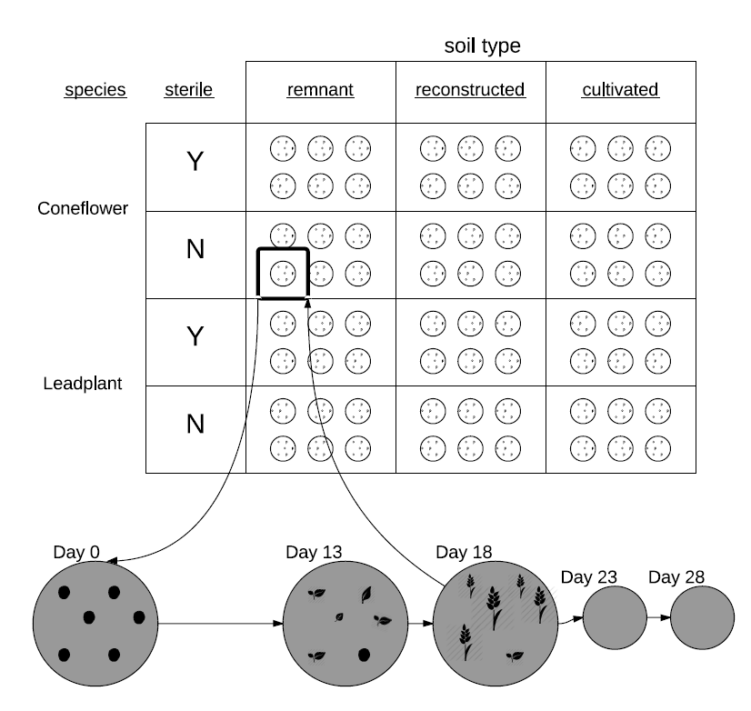
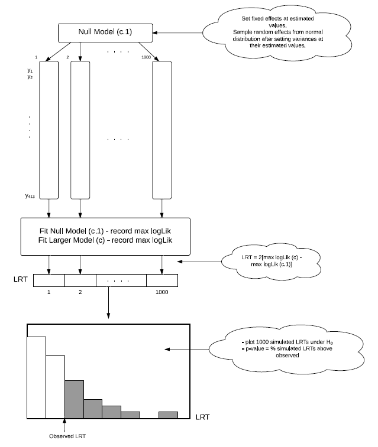

#Multilevel Data With More Than Two Levels {#ch-3level}
##Learning Objectives
After finishing this chapter, you should be able to:

- Extend the standard multilevel model to cases with more than two levels.
- Apply exploratory data analysis techniques specific to data from more than two levels.
- Formulate multilevel models including the variance-covariance structure.
- Build and understand a taxonomy of models for data with more than two levels.
- Interpret parameters in models with more than two levels.
- Develop strategies for handling an exploding number of parameters in multilevel models.
- Recognize when a fitted model has encountered boundary constraints and understand strategies for moving forward.
- Understand how a parametric bootstrap test of significance works and when it might be useful.

##Case Studies: Seed Germination {#cs:seeds}
It is estimated that 82-99\% of historic tallgrass prairie ecosystems have been converted to agricultural use [@Baer2002]. A prime example of this large scale conversion of native prairie to agricultural purposes can be seen in Minnesota, where less than 1\% of the prairies that once existed in the state still remain [@Camill2004]. Such large scale alteration of prairie communities has been associated with numerous problems. For example, erosion and decomposition that readily take place in cultivated soils have increased atmospheric CO2 levels and increased nitrogen inputs to adjacent waterways (@Baer2002, @Camill2004, @Knops2000). In addition, cultivation practices are known to affect rhizosphere composition as tilling can disrupt networks of soil microbes [@Allison2005]. The [rhizosphere](http://en.wikipedia.org/wiki/Rhizosphere) is the narrow region of soil that is directly influenced by root secretions and associated soil microorganisms; much of the nutrient cycling and disease suppression needed by plants occur immediately adjacent to roots. It is important to note that microbial communities in prairie soils have been implicated with plant diversity and overall ecosystem function by controlling carbon and nitrogen cycling in the soils [@Zak2003]. 

There have been many responses to these claims, but one response in recent years is reconstruction of the native prairie community. These reconstruction projects provide new habitat for a variety of native prairie species, yet it is important to know as much as possible about the outcomes of prairie reconstruction projects in order to ensure that a functioning prairie community is established. The ecological repercussions resulting from prairie reconstruction are not well known. For example, all of the aforementioned changes associated with cultivation practices are known to affect the subsequent reconstructed prairie community (@Baer2002, @Camill2004), yet there are few explanations for this phenomenon. For instance, prairies reconstructed in different years (using the same seed combinations and dispersal techniques) have yielded disparate prairie communities. 

Researchers at a small Midwestern college decided to experimentally explore the underlying causes of variation in reconstruction projects in order to make future projects more effective. Introductory ecology classes were organized to collect longitudinal data on native plant species grown in a greenhouse setting, using soil samples from surrounding lands [@Angell2010]. We will examine their data to compare germination and growth of two species of prairie plants---leadplants (*Amorpha canescens*) and coneflowers (*Ratibida pinnata*)---in soils taken from a remnant (natural) prairie, a cultivated (agricultural) field, and a restored (reconstructed) prairie. Additionally, half of the sampled soil was sterilized to determine if rhizosphere differences were responsible for the observed variation, so we will examine the effects of sterilization as well.

The data we'll examine was collected through an experiment run using a 3x2x2 factorial design, with 3 levels of soil type (remnant, cultivated, and restored), 2 levels of sterilization (yes or no), and 2 levels of species (leadplant and coneflower). Each of the 12 treatments (unique combinations of factor levels) was replicated in 6 pots, for a total of 72 pots. Six seeds were planted in each pot (although a few pots had 7 or 8 seeds), and initially student researchers recorded days to germination (defined as when two leaves are visible), if germination occurred. In addition, the height of each germinated plant (in mm) was measured at 13, 18, 23, and 28 days after planting. The study design is illustrated in the diagram below.

```{r load_packagesv3, include=FALSE}
# Be sure to install first if needed
library(knitr)
library(ggplot2)
# library(splines)
library(gridExtra)
library(GGally)
library(mice)
library(dplyr)
library(tidyr)
library(stringr)
library(nlme)
library(lme4)
library(lmeresampler)
library(mnormt)
library(boot)
library(HLMdiag)
library(kableExtra)
library(pander)
```



##Initial Exploratory Analyses {#explore3}
###Data Organization {#organizedata3}
Data for Case Study \@ref(cs:seeds) in `seeds2.csv` contains the following variables:

- `pot` = Pot plant was grown in (1-72)
- `plant` = Unique plant identification number
- `species` = L for leadplant and C for coneflower
- `soil` = STP for reconstructed prairie, REM for remnant prairie, and CULT for cultivated land
- `sterile` = Y for yes and N for no
- `germin` = Y if plant germinated, N if not
- `hgt13` = height of plant (in mm) 13 days after seeds planted
- `hgt18` = height of plant (in mm) 18 days after seeds planted
- `hgt23` = height of plant (in mm) 23 days after seeds planted
- `hgt28` = height of plant (in mm) 28 days after seeds planted
    
This data is stored in wide format, with one row per plant (see 12 sample plants in Table \@ref(tab:table1chp10)). As we have done in previous multilevel analyses, we will convert to long format (one observation per plant-time combination) after examining the missing data pattern and removing any plants with no growth data. In this case, we are almost assuredly losing information by removing plants with no height data at all four time points, since these plants did not germinate, and there may well be differences between species, soil type, and sterilization with respect to germination rates. We will handle this possibility by analyzing germination rates separately (see Chapter \@ref(ch-GLMM)); the analysis in this chapter will focus on effects of species, soil type, and sterilization on initial growth and growth rate among plants that germinate.
```{r, include=FALSE}
#Getting started
#great base theme for ggplots
theme.1 <- theme(axis.title.x = element_text(size = 14),
  axis.title.y = element_text(size = 14),
  plot.title=element_text(hjust=.9,face="italic",size=12))

# seedwd <- read.csv(file=file.choose())  # seeds2.csv
seedwd <- read.csv("data/seeds2.csv")
seedwd[135:146,2:11]   # illustrate wide data
```

```{r table1chp10, echo=FALSE}
table1chp10 <- seedwd[135:146,2:11]   # illustrate wide data
kable(table1chp10, booktabs=T, caption="A snapshot of data (Plants 231-246) from the Seed Germination case study in wide format.")
```

Although the experimental design called for $72*6=432$ plants, the wide data set has 437 plants because a few pots had more than six plants (likely because two of the microscopically small seeds stuck together when planted). Of those 437 plants, 154 had no height data (did not germinate by the 28th day) and were removed from analysis (for example, see rows 145-146 in Table \@ref(tab:table1chp10)). 248 plants had complete height data (e.g., rows 135-139 and 141-143), 13 germinated later than the 13th day but had complete heights once they germinated (e.g., row 144), and 22 germinated and had measurable height on the 13th day but died before the 28th day (e.g., row 140). Ultimately, the long data set contains 1132 unique observations where plants heights were recorded; representation of plants 236-242 in the long data set can be seen in Table \@ref(tab:table2chp10).

```{r, include=FALSE}
# Investigate patterns of missingness
md.pattern(seedwd)

# Remove plants that did not germinate
seedwd <- seedwd %>%
  mutate(nope = is.na(hgt13)+is.na(hgt18)+is.na(hgt23)+is.na(hgt28)) %>%
  filter(nope < 4)

# Create data frame in LONG form (one obs per plant measurement time)
seedlg <- seedwd %>%
  gather(key = time, value = hgt, hgt13:hgt28) %>%
  mutate(time = as.integer(str_sub(time, -2)),
         time13 = time - 13 ) 
```

```{r table2chp10, echo=FALSE}
#tablelong
tab2chp10 <- seedlg %>% filter(plant %in% c(236:242)) %>%
  arrange(plant, time13)
tab2chp10df <- data.frame(tab2chp10)
table2chp10 <- tab2chp10df[,c(2,3,4,5,6,7,10,11)]
kable(table2chp10, booktabs=T, caption="A snapshot of data (Plants 236-242) from the Seed Germination case study in long format.")
```

Notice the __three-level structure__ of this data. Treatments (levels of the three experimental factors) were assigned at the `pot` level, then multiple plants were grown in each pot, and multiple measurements were taken over time for each plant. Our multilevel analysis must therefore account for pot-to-pot variability in height measurements (which could result from factor effects), plant-to-plant variability in height within a single pot, and variability over time in height for individual plants. In order to fit such a three-level model, we must extend the two-level model which we have used thus far.

###Exploratory Analyses {#explore3v2}
We start by taking an initial look at the effect of Level Three covariates (factors applied at the pot level: species, soil type, and sterilization) on plant height, pooling observations across pot, across plant, and across time of measurement within plant. First, we observe that the initial balance which existed after randomization of pot to treatment no longer holds. After removing plants that did not germinate (and therefore had no height data), more height measurements exist for coneflowers (n=704, compared to 428 for leadplants), soil from restored prairies (n=524, compared to 288 for cultivated land and 320 for remnant prairies), and unsterilized soil (n=612, compared to 520 for sterilized soil). This imbalance indicates possible factor effects on germination rate; we will take up those hypotheses in Chapter \@ref(ch-GLMM). In this chapter, we will focus on the effects of species, soil type, and sterilization on the growth patterns of plants that germinate.

Because we suspect that height measurements over time for a single plant are highly correlated, while height measurements from different plants from the same pot are relatively uncorrelated, we calculate mean height per plant (over all available time points) before generating exploratory plots investigating Level Three factors. Figure \@ref(fig:boxbyspec) then examines the effects of soil type and sterilization separately by species. Sterilization seems to have a bigger benefit for coneflowers, while soil from remnant prairies seems to lead to smaller leadplants and taller coneflowers.

```{r, include=FALSE}
#getting started-2
# create indicator variables for later analyses
seedlg <- seedlg %>%
  mutate(cult=ifelse(soil=="CULT",1,0),
         rem=ifelse(soil=="REM",1,0),
         stp=ifelse(soil=="STP",1,0),
         lead=ifelse(species=="L",1,0),
         cone=ifelse(species=="C",1,0),
         strl=ifelse(sterile=="Y",1,0),
         nostrl=ifelse(sterile=="N",1,0) )

# create separate data sets of leadplants and coneflowers
conedata <- seedlg %>%
  filter(cone==1)
leaddata <- seedlg %>%
  filter(lead==1)

## Exploratory data analysis ##

# Rough look at Level Three covariates
seedlg %>% count(species)
seedlg %>% count(soil)
seedlg %>% count(sterile)

# From here on, do everything separately for leadplants and coneflowers #

# Add average across all time points for each plant for EDA plots
meanplant <- seedlg %>% group_by(plant) %>%
  summarise(meanplant = mean(hgt, na.rm = TRUE))
seedwd <- seedwd %>%
  left_join(meanplant, by = "plant")
conewd <- seedwd %>%
  filter(species=="C")
leadwd <- seedwd %>%
  filter(species=="L")
```

```{r boxbyspec, fig.align="center",out.width="60%", fig.cap='Plant height comparisons of (a) soil type and (b) sterilization within species.  Each plant is represented by the mean height over all measurements at all time points for that plant.',echo=FALSE, warning=FALSE}
#thr-boxplots-byspecies
# One obs per plant - assume plants relatively independent within pots
cone.soil <- ggplot(conedata,aes(x=soil,y=hgt)) + 
  geom_boxplot() + 
  theme.1 + 
  labs(x="Soil type",y="Plant Height (mm)",title="Coneflowers (a)")
cone.sterile <- ggplot(conedata,aes(x=sterile,y=hgt)) + 
  geom_boxplot() + 
  theme.1 + 
  labs(x="Sterilized",y="Plant Height (mm)",title="Coneflowers (b)")
lead.soil <- ggplot(leaddata,aes(x=soil,y=hgt)) + 
  geom_boxplot() + 
  theme.1 + 
  labs(x="Soil type",y="Plant Height (mm)",title="Leadplants (a)")
lead.sterile <- ggplot(leaddata,aes(x=sterile,y=hgt)) + 
  geom_boxplot() + 
  theme.1 + 
  labs(x="Sterilized",y="Plant Height (mm)",title="Leadplants (b)")
grid.arrange(cone.soil, cone.sterile, lead.soil, lead.sterile,
                                   ncol=2)
```

We also use spaghetti plots to examine time trends within species to see (a) if it is reasonable to assume linear growth between Day 13 and Day 28 after planting, and (b) if initial height and rate of growth is similar in the two species. Figure \@ref(fig:spagbyspec) illustrates differences between species. While both species have similar average heights 13 days after planting, coneflowers appear to have faster early growth which slows later, while leadplants have a more linear growth rate which culminates in greater average heights 28 days after planting. Coneflowers also appear to have greater variability in initial height and growth rate, although there are more coneflowers with height data.

```{r,spagbyspec,fig.align="center",out.width="60%", fig.cap='Spaghetti plot by species with loess fit.  Each "line" represents one plant.',echo=FALSE, warning=FALSE, message=FALSE}
#thr-spaghetti-byspecies
# spaghetti plot by species - all plants (This plot used earlier now)
#   add loess smoothing curve for overall trend
# To get rid of warnings, run as Rmd with warning=FALSE in global options
#   or chunk options
seedlg <- seedlg %>%
  mutate(speciesname = ifelse(species=="C","Coneflowers","Leadplants") )
options(warn = -1)
ggplot(seedlg,aes(x=time,y=hgt)) + 
  geom_line(aes(group=plant),color="dark grey") + 
  facet_wrap(~speciesname,ncol=2) + 
  geom_smooth(se=FALSE,color="black") + 
  theme.1 + 
  labs(x="Days since seeds planted",y="Plant height (mm)")
options(warn = -1)
```

Exploratory analyses such as these confirm the suspicions of biology researchers that leadplants and coneflowers should be analyzed separately. Because of biological differences, it is expected that these two species will show different growth patterns and respond differently to treatments such as fertilization. Coneflowers are members of the aster family, growing up to 4 feet tall with their distinctive gray seed heads and drooping yellow petals. Leadplants, on the other hand, are members of the bean family, with purple flowers, a height of 1 to 3 feet, and compound greyish green leaves which look to be dusted with white lead. Leadplants have deep root systems and are symbiotic N-fixers, which means they might experience stifled growth in sterilized soil compared with other species. For the remainder of this chapter, we will focus on __leadplants__ and how their growth patterns are affected by soil type and sterilization. You will have a chance to analyze coneflower data later in the Exercises section.

Lattice plots, illustrating several observational units simultaneously, each with fitted lines where appropriate, are also valuable to examine during the exploratory analysis phase. Figure \@ref(fig:lattlpall) shows height over time for 24 randomly selected leadplants that germinated in this study, with a fitted linear regression line. Linearity appears reasonable in most cases, although there is some variability in the intercepts and a good deal of variability in the slopes of the fitted lines. These intercepts and slopes by plant, of course, will be potential parameters in a multilevel model which we will fit to this data. Given the three-level nature of this data, it is also useful to examine a spaghetti plot by pot (Figure \@ref(fig:spaglppot)). While linearity appears to reasonably model the average trend over time within pot, we see differences in the plant-to-plant variability within pot, but some consistency in intercept and slope from pot to pot.

```{r, lattlpall, fig.align="center",out.width="60%", fig.cap=' Lattice plot of linear trends fit to 24 randomly selected leadplants.  One plant with only a single height measurement has no associated regression line.',echo=FALSE, warning=FALSE, message=FALSE}
#thr-linearlattice-lpall
# Plot time trend for 25 randomly selected leadplants - linear fit
set.seed(1313)
randplant = as.vector(sample(leadwd$plant,size=25))
seedrdl <- seedlg %>%
  filter(plant %in% randplant)
ggplot(seedrdl, aes(x=time, y=hgt)) + 
  facet_wrap(~plant,ncol=5) + 
  geom_point() + 
  geom_smooth(method="lm") + 
  theme.1 +
  theme(strip.text.x=element_blank()) + 
  labs(x="Time",y="Plant height (mm)")
```

```{r, spaglppot, fig.align="center",out.width="60%", fig.cap='Spaghetti plot for leadplants by pot with loess fit.',echo=FALSE, warning=FALSE, message=FALSE}
#thr-spaghetti-lpbypot
# spaghetti plot by pot - add loess smoothing curve for overall trend
oldw <- getOption("warn")
options(warn = -1)
ggplot(leaddata, aes(x=time, y=hgt)) + 
  geom_line(aes(group=plant), color="dark grey") + 
  theme.1 + 
  facet_wrap(~pot, ncol=7) + 
  geom_smooth(se=FALSE, color="black") + 
  labs(x="Days since seeds planted",y="Plant height (mm)")
options(warn = oldw)
```

Spaghetti plots can also be an effective tool for examining the potential effects of soil type and sterilization on growth patterns of leadplants. Figure \@ref(fig:spaglpsoil) and Figure \@ref(fig:spaglpster) illustrate how the growth patterns of leadplants depend on soil type and sterilization. In general, we observe slower growth in soil from remnant prairies and soil that has not been sterilized.

```{r, spaglpsoil, fig.align="center",out.width="60%", fig.cap='Spaghetti plot for leadplants by soil type with loess fit.',echo=FALSE, warning=FALSE, message=FALSE}
#thr-spaghetti-lpbysoil
leaddata <- leaddata %>%
  mutate(soilname = recode(soil, STP="Reconstructed", CULT="Cultivated",
                                    REM="Remnant") )
options(warn = -1)
ggplot(leaddata,aes(x=time,y=hgt)) + 
  geom_line(aes(group=plant),color="dark grey") + 
  facet_wrap(~soilname,ncol=3) + 
  geom_smooth(se=FALSE,color="black") + 
  theme.1 + 
  labs(x="Days since seeds planted",y="Plant height (mm)") 
options(warn = oldw)
```

```{r, spaglpster, fig.align="center",out.width="60%", fig.cap='Spaghetti plot for leadplants by sterilization with loess fit.',echo=FALSE, warning=FALSE, message=FALSE}
#thr-spaghetti-lpbysterile
leaddata <- leaddata %>%
  mutate(sterilename = recode(sterile, Y="Sterilized", N="Not Sterilized") )
options(warn = -1)
ggplot(leaddata,aes(x=time,y=hgt)) + 
  geom_line(aes(group=plant),color="dark grey") + 
  facet_wrap(~sterilename,ncol=2) + 
  geom_smooth(se=FALSE,color="black") + 
  theme.1 + 
  labs(x="Days since seeds planted",y="Plant height (mm)") 
options(warn = oldw)
```

We can further explore the variability in linear growth among plants and among pots by fitting regression lines and examining the estimated intercepts and slopes, as well as the corresponding R-squared values. Figures \@ref(fig:intrateplant) and \@ref(fig:intratepot) provide just such an analysis, where Figure \@ref(fig:intrateplant) shows results of fitting lines by plant, and Figure \@ref(fig:intratepot) shows results of fitting lines by pot. Certain caveats accompany these summaries. In the case of fitted lines by plant, each plant is given equal weight regardless of the number of observations (2-4) for a given plant, and in the case of fitted lines by pot, a line is estimated by simply pooling all observations from a given pot, ignoring the plant from which the observations came, and equally weighting pots regardless of how many plants germinated and survived to Day 28. Nevertheless, the summaries of fitted lines provide useful information. When fitting regression lines by plant, we see a mean intercept of 1.52 (SD=0.66), indicating an estimated average height at 13 days of 1.5 mm, and a mean slope of 0.114 mm per day of growth from Days 13 to 28 (SD=0.059). Most R-squared values were strong (e.g., 84\% were above 0.8). Summaries of fitted regression lines by pot show similar mean intercepts (1.50) and slopes (0.107), but somewhat less variability pot-to-pot than we observed plant-to-plant (SD=0.46 for intercepts and SD=0.050 for slopes).

```{r, include=FALSE}
# Summary stats for linear models by plant - use centered time
hgt.list=lmList(hgt~time13 | plant, data=leaddata, na.action=na.exclude)
# coef(hgt.list)
int = as.matrix(coef(hgt.list))[,1]
summary(int)   # summary statistics for 107 intercepts
rate = as.matrix(coef(hgt.list))[,2]
summary(rate)
rsq <- by(leaddata, leaddata$plant, function(data)
  summary(lm(hgt ~ time13, data = data,na.action=na.exclude))$r.squared)
summary(rsq)
sum(rsq[!is.na(rsq)]>=.8)/length(rsq[!is.na(rsq)])

int.rate.rsq <- as.data.frame(cbind(int,rate,rsq))
int.hist <- ggplot(int.rate.rsq,aes(x=int)) + 
  geom_histogram(binwidth=0.5,color="black",fill="white") + 
  theme.1 + labs(x="Intercepts",y="Frequency",title="(a)")
rate.hist <- ggplot(int.rate.rsq,aes(x=rate)) + 
  geom_histogram(binwidth=0.05,color="black",fill="white") + 
  theme.1 + labs(x="Slopes",y="Frequency",title="(b)")
rsq.hist <- ggplot(int.rate.rsq,aes(x=rsq)) + 
  geom_histogram(binwidth=0.1,color="black",fill="white") +
  theme.1 + labs(x="R squared values",y="Frequency",title="(c)")
```

```{r, intrateplant, fig.align="center",out.width="60%", fig.cap=' Histograms of (a) intercepts, (b) slopes, and (c) R-squared values for linear fits across all leadplants.',echo=FALSE, warning=FALSE}
#thr-intrate-lpbyplant
grid.arrange(int.hist,rate.hist,rsq.hist,ncol=2)
```

```{r, include=FALSE}
#    Descriptive statistics of the estimates obtained by fitting the 
#      linear model by plant.
mean(int)
sd(int)
mean(rate, na.rm=T)
sd(rate, na.rm=T)
cor(int, rate, use="complete.obs")   

# Summary stats for linear models by pot
hgt2.list=lmList(hgt~time13 | pot, data=leaddata, na.action=na.exclude)
# coef(hgt2.list)
int2 = as.matrix(coef(hgt2.list))[,1]
summary(int2)   # summary statistics for 32 intercepts
rate2 = as.matrix(coef(hgt2.list))[,2]
summary(rate2)
rsq2 <- by(leaddata, leaddata$pot, function(data)
  summary(lm(hgt ~ time13, data = data,na.action=na.exclude))$r.squared)
summary(rsq2)

int.rate.rsq2 <- as.data.frame(cbind(int2,rate2,rsq2))
int2.hist <- ggplot(int.rate.rsq2,aes(x=int2)) + 
  geom_histogram(binwidth=0.5,color="black",fill="white") + 
  theme.1 + labs(x="Intercepts",y="Frequency",title="(a)")
rate2.hist <- ggplot(int.rate.rsq2,aes(x=rate2)) + 
  geom_histogram(binwidth=0.05,color="black",fill="white") + 
  theme.1 + labs(x="Slopes",y="Frequency",title="(b)")
rsq2.hist <- ggplot(int.rate.rsq2,aes(x=rsq2)) + 
  geom_histogram(binwidth=0.2,color="black",fill="white") + 
  theme.1 + labs(x="R squared values",y="Frequency",title="(c)")
```

```{r, intratepot, fig.align="center",out.width="60%", fig.cap='Histograms of (a) intercepts, (b) slopes, and (c) R-squared values for linear fits across all pots with leadplants.',echo=FALSE, warning=FALSE}
#thr-intrate-lpbypot
grid.arrange(int2.hist,rate2.hist,rsq2.hist,ncol=2)
```

Another way to examine variability due to plant vs. variability due to pot is through summary statistics. Plant-to-plant variability can be estimated by averaging standard deviations from each pot (.489 for intercepts and .039 for slopes), while pot-to-pot variability can be estimated by finding the standard deviation of average intercept (.478) or slope (.051) within pot. Based on these rough measurements, variability due to plants and pots is comparable.

Fitted lines by plant and pot are modeled using a centered time variable (`time13`), adjusted so that the first day of height measurements (13 days after planting) corresponds to `time13`=0. This centering has two primary advantages. First, the estimated intercept becomes more interpretable. Rather than representing height on the day of planting (which should be 0 mm, but which represents a hefty extrapolation from our observed range of days 13 to 28), the intercept now represents height on Day 13. Second, the intercept and slope are much less correlated (r=-0.16) than when uncentered time is used, which improves the stability of future models.

Fitted intercepts and slopes by plant can be used for an additional exploratory examination of factor effects to complement those from the earlier spaghetti plots. Figure \@ref(fig:irboxbyspec) complements Figure \@ref(fig:spagbyspec), again showing differences between species---coneflowers tend to start smaller and have slower growth rates, although they have much more variability in growth patterns than leadplants. Returning to our focus on leadplants, Figure \@ref(fig:irboxbysoil) shows that plants grown in soil from cultivated fields tends to be taller at Day 13, and plants grown in soil from remnant prairies tend to grow more slowly than plants grown in other soil types. Figure \@ref(fig:irboxbyster) shows the strong tendency for plants grown in sterilized soil to grow faster than plants grown in non-sterilized soil. We will soon see if our fitted multilevel models support these observed trends.

```{r, include=FALSE}
#    Descriptive statistics of the estimates obtained by fitting the 
#      linear model by pot.
mean(int2)
sd(int2)
mean(rate2, na.rm=T)
sd(rate2, na.rm=T)
cor(int2, rate2, use="complete.obs")   

# Try to compare variability between plants and between pots
#   Plus ANOVA-type boxplot of within pot vs within plant variability

seedwdplus <- seedwd %>%
  filter(species=="L") %>%
  mutate(int = int, rate = rate)
bypot <- seedwdplus %>%
  group_by(pot) %>%
  summarise(sd_int = unname(sd(int)),
            mean_int = unname(mean(int)),
            sd_rate = unname(sd(rate)),
            mean_rate = unname(mean(rate)) )

mean(bypot$sd_int,na.rm=T)   # intercept variability between plants = .489
mean(bypot$sd_rate,na.rm=T)   # rate variability between plants = .039
sd(bypot$mean_int,na.rm=T)   # intercept variability between pots = .478
sd(bypot$mean_rate,na.rm=T)   # rate variability between pots = .051

# Boxplots to compare ints and rates by factor levels
hgt.listc=lmList(hgt~time13 | plant, data=conedata, na.action=na.exclude)
intc = as.matrix(coef(hgt.listc))[,1]
ratec = as.matrix(coef(hgt.listc))[,2]
allfits <- tibble(int = c(int, intc),
                  rate = c(rate, ratec),
                  species = c(rep("Leadplants", 107), rep("Coneflowers", 176)) )
```

```{r, irboxbyspec,fig.align="center",out.width="60%", fig.cap='Boxplots of (a) intercepts and (b) slopes for all plants by species, based on a linear fit to height data from each plant.',echo=FALSE, warning=FALSE}
#thr-intrate-byspecies
int.byspecies <- ggplot(allfits,aes(x=species,y=int)) + 
  geom_boxplot(aes(group=species)) + 
  theme.1 +
  labs(x="Species",y="Intercepts",title="(a)") 
rate.byspecies <- ggplot(allfits, aes(x=species,y=rate)) + 
  geom_boxplot(aes(group=species)) + 
  theme.1 + 
  labs(x="Species",y="Slopes",title="(b)") 
grid.arrange(int.byspecies,rate.byspecies,ncol=2)
```

```{r, irboxbysoil,fig.align="center",out.width="60%", fig.cap='Boxplots of (a) intercepts and (b) slopes for all leadplants by soil type, based on a linear fit to height data from each plant.',echo=FALSE, warning=FALSE}
#thr-intrate-bysoil
seedwdplus <- seedwdplus %>%
  mutate(soilname = recode(soil, STP="Reconstructed", CULT="Cultivated",
                           REM="Remnant") )
int.bysoil <- ggplot(seedwdplus,aes(x=soilname,y=int)) + 
  geom_boxplot() + 
  theme.1 +
  labs(x="Soil type",y="Intercepts",title="(a)")
rate.bysoil <- ggplot(seedwdplus,aes(x=soilname,y=rate)) + 
  geom_boxplot() + 
  theme.1 +
  labs(x="Soil type",y="Slopes",title="(b)")
grid.arrange(int.bysoil,rate.bysoil,ncol=2)
```

```{r, irboxbyster, fig.align="center",out.width="60%", fig.cap='Boxplots of (a) intercepts and (b) slopes for all leadplants by sterilization, based on a linear fit to height data from each plant.',echo=FALSE, warning=FALSE}
#thr-intrate-bysterile
seedwdplus <- seedwdplus %>%
  mutate(sterilename = recode(sterile, Y="Sterilized", N="Not Sterilized") )
int.bysterile <- ggplot(seedwdplus,aes(x=sterilename,y=int)) + 
  geom_boxplot() + 
  theme.1 +
  labs(x="Sterile",y="Intercepts",title="(a)")
rate.bysterile <- ggplot(seedwdplus,aes(x=sterilename,y=rate)) + 
  geom_boxplot() + 
  theme.1 + 
  labs(x="Sterile",y="Slopes",title="(b)")
grid.arrange(int.bysterile,rate.bysterile,ncol=2)
```

Since we have time at Level One, any exploratory analysis of Case Study \@ref(cs:seeds) should contain an investigation of the variance-covariance structure within plant. Figure \@ref(fig:corrstruct) shows the potential for an autocorrelation structure in which the correlation between observations from the same plant diminishes as the time between measurements increases. Residuals five days apart have correlations ranging from .77 to .91, while measurements ten days apart have correlations of .62 and .70, and measurements fifteen days apart have correlation of .58.

```{r, corrstruct, fig.align="center",out.width="60%",fig.cap='Correlation structure within plant.  The upper right contains correlation coefficients between residuals at pairs of time points, the lower left contains scatterplots of the residuals at time point pairs, and the diagonal contains histograms of residuals at each of the four time points.',echo=FALSE, warning=FALSE, message=FALSE}
#thr-correlation-lp
# Examine correlation structure
seed.nona <- leaddata %>%
  filter(!is.na(hgt))
hgt.lm = lm(hgt~time13, data=seed.nona)
seed.nona <- seed.nona %>%
  mutate(lmres = resid(hgt.lm))
hgtw <- seed.nona %>%
  dplyr::select(plant, time13, lmres) %>%
  spread(key = time13, value = lmres, sep = "=") 
hgtw.1 <- na.omit(hgtw)
ggpairs(hgtw.1[,2:5], lower=list(continuous="smooth"),
  upper=list(), diag=list(continuous="bar", discrete="bar"),
  axisLabels="show") 
```

##Initial models: unconditional means and unconditional growth {#initialmodels-3level}
The structure and notation for three level models will closely resemble the structure and notation for two level models, just with extra subscripts. Therein lies some of the power of multilevel models---extensions are relatively easy and allow you to control for many sources of variability, obtaining more precise estimates of important parameters. However, the number of variance component parameters to estimate can quickly mushroom as covariates are added at lower levels, so implementing simplifying restrictions will often become necessary (see Section \@ref(sec:explodingvarcomps)).

We once again begin with the __unconditional means model__, in which there are no predictors at any level, in order to assess the amount of variation at each level. Here, Level Three is pot, Level Two is plant within pot, and Level One is time within plant. Using model formulations at each of the three levels, the unconditional means three-level model can be expressed as:

- Level One (timepoint within plant):
\begin{equation}
Y_{ijk} = a_{ij}+\epsilon_{ijk} \textrm{ where } \epsilon_{ijk}\sim N(0,\sigma^2)
(\#eq:initunun)
\end{equation}
- Level Two (plant within pot):
\begin{equation}
a_{ij} = a_{i}+u_{ij} \textrm{ where } u_{ij}\sim N(0,\sigma_{u}^{2})
(\#eq:initunun2)
\end{equation}
- Level Three (pot):
\begin{equation}
a_{i} = \alpha_{0}+\tilde{u}_{i} \textrm{ where } \tilde{u}_{i} \sim N(0,\sigma_{\tilde{u}}^{2})
(\#eq:initunun3)
\end{equation}

where the heights of plants from different pots are considered independent, but plants from the same pot are correlated as well as measurements at different times from the same plant.

Keeping track of all the model terms, especially with three subscripts, is not a trivial task, but it's worth spending time thinking through. Here is a quick guide to the meaning of terms found in our three-level model:

- $Y_{ijk}$ is the height (in mm) of plant $j$ from pot $i$ at time $k$
- $a_{ij}$ is the true mean height for plant $j$ from pot $i$ across all time points. This is not considered a model parameter, since we further model $a_{ij}$ at Level Two.
- $a_{i}$ is the true mean height for pot $i$ across all plants from that pot and all time points. This is also not considered a model parameter, since we further model $a_{i}$ at Level Three.
- $\alpha_{0}$ is a fixed effects model parameter representing the true mean height across all pots, plants, and time points
- $\epsilon_{ijk}$ describes how far an observed height $Y_{ijk}$ is from the mean height for plant $j$ from pot $i$
- $u_{ij}$ describe how far the mean height of plant $j$ from pot $i$ is from the mean height of all plants from pot $i$
- $\tilde{u}_{i}$ describes how far the mean height of all observations from pot $i$ is from the overall mean height across all pots, plants, and time points. None of the error terms ($\epsilon, u, \tilde{u}$) are considered model parameters; they simply account for differences between the observed data and expected values under our model.
- $\sigma^2$ is a variance component (random effects model parameter) that describes within-plant variability over time
- $\sigma_{u}^{2}$ is the variance component describing plant-to-plant variability within pot
- $\sigma_{\tilde{u}}^{2}$ is the variance component describing pot-to-pot variability.

The three-level unconditional means model can also be expressed as a composite model:
\begin{equation}
Y_{ijk}=\alpha_{0}+\tilde{u}_{i}+u_{ij}+\epsilon_{ijk}
(\#eq:initununcomp)
\end{equation}

and this composite model can be fit using statistical software:

```{r, 10verb1, echo=FALSE, comment=NA}
# Model A - unconditional means
modelal = lmer(hgt ~ 1 + (1|plant) + (1|pot), REML=T, data=leaddata)
# print(summary(modelal), correlation=FALSE, show.resids=FALSE)
tmp <- capture.output(summary(modelal))
cat(tmp[c(2, 10:20)], sep='\n')
```

From this output, we obtain estimates of our four model parameters:

- $\hat{\alpha}_{0}=2.39=$ the mean height (in mm) across all time points, plants, and pots.
- $\hat{\sigma}^2=0.728=$ the variance over time within plants.
- $\hat{\sigma}_{u}^{2}=0.278=$ the variance between plants from the same pot.
- $\hat{\sigma}_{\tilde{u}}^{2}=0.049=$ the variance between pots.

From the estimates of variance components, 69.0\% of total variability in height measurements is due to differences over time for each plant, 26.4\% of total variability is due to differences between plants from the same pot, and only 4.6\% of total variability is due to difference between pots. Accordingly, we will next explore whether the incorporation of time as a linear predictor at Level One can reduce the unexplained variability within plant.

The __unconditional growth model__ introduces time as a predictor at Level One, but there are still no predictors at Levels Two or Three. The unconditional growth model allows us to assess how much of the within-plant variability (the variability among height measurements from the same plant at different time points) can be attributed to linear changes over time, while also determining how much variability we see in the intercept (Day 13 height) and slope (daily growth rate) from plant-to-plant and pot-to-pot. Later, we can model plant-to-plant and pot-to-pot differences in intercepts and slopes with Level Two and Three covariates.

The three-level unconditional growth model (Model B) can be specified either using formulations at each level:

- Level One (timepoint within plant):
\begin{equation}
Y_{ijk} = a_{ij}+b_{ij}\textstyle{time}_{ijk}+\epsilon_{ijk}
(\#eq:timewithplnt)
\end{equation}
- Level Two (plant within pot):
\begin{align*}
a_{ij} & = a_{i}+u_{ij} \\
b_{ij} & = b_{i}+v_{ij}
\end{align*}
- Level Three (pot):
\begin{align*}
a_{i} & = \alpha_{0}+\tilde{u}_{i} \\
b_{i} & = \beta_{0}+\tilde{v}_{i}
\end{align*}

or as a composite model:
\begin{equation}
Y_{ijk}=[\alpha_{0}+\beta_{0}\textstyle{time}_{ijk}]+
[\tilde{u}_{i}+{v}_{ij}+\epsilon_{ijk}+(\tilde{v}_{i}+{v}_{ij})\textstyle{time}_{ijk}]
(\#eq:compmodb)
\end{equation}

where $\epsilon_{ijk}\sim N(0,\sigma^2)$,
\[ \left[ \begin{array}{c}
            u_{ij} \\ v_{ij}
          \end{array}  \right] \sim N \left( \left[
          \begin{array}{c}
            0 \\ 0
          \end{array} \right], \left[
          \begin{array}{cc}
            \sigma_{u}^{2} & \\
            \sigma_{uv} & \sigma_{v}^{2}
          \end{array} \right] \right), \] and
\[ \left[ \begin{array}{c}
            \tilde{u}_{i} \\ \tilde{v}_{i}
          \end{array}  \right] \sim N \left( \left[
          \begin{array}{c}
            0 \\ 0
          \end{array} \right], \left[
          \begin{array}{cc}
            \sigma_{\tilde{u}}^{2} & \\
            \sigma_{\tilde{u}\tilde{v}} & \sigma_{\tilde{v}}^{2}
          \end{array} \right] \right). \]

In this model, at Level One the trajectory for plant $j$ from pot $i$ is assumed to be linear, with intercept $a_{ij}$ (height on Day 13) and slope $b_{ij}$ (daily growth rate between Days 13 and 28); the $\epsilon_{ijk}$ terms capture the deviation between the true growth trajectory of plant $j$ from pot $i$ and its observed heights. At Level Two, $a_{i}$ represents the true mean intercept and $b_{i}$ represents the true mean slope for all plants from pot $i$, while $u_{ij}$ and $v_{ij}$ capture the deviation between plant $j$'s true growth trajectory and the mean intercept and slope for pot $i$. The deviations in intercept and slope at Level Two are allowed to be correlated through the covariance parameter $\sigma_{uv}$. Finally, $\alpha_{0}$ is the true mean intercept and $\beta_{0}$ is the true mean daily growth rate over the entire population of leadplants, while $\tilde{u}_{i}$ and $\tilde{v}_{i}$ capture the deviation between pot $i$'s true overall growth trajectory and the population mean intercept and slope. Note that between-plant and between-pot variability are both partitioned now into variability in initial status ($\sigma_{u}^{2}$ and $\sigma_{\tilde{u}}^{2}$) and variability in rates of change ($\sigma_{v}^{2}$ and $\sigma_{\tilde{v}}^{2}$).

Using the composite model specification, the unconditional growth model can be fit to the seed germination data:
```{r 10verb2, echo=FALSE, comment=NA}
# Model B - unconditional growth
modelbl = lmer(hgt ~ time13 + (time13|plant) + (time13|pot), 
  REML=T, data=leaddata)
# print(summary(modelbl), correlation=FALSE, show.resids=FALSE)
tmp <- capture.output(summary(modelbl))
cat(tmp[c(2, 10:23)], sep='\n')
```

From this output, we obtain estimates of our nine model parameters (two fixed effects and seven variance components):

- $\hat{\alpha}_{0}=1.538=$ the mean height of leadplants 13 days after planting.
- $\hat{\beta}_{0}=0.112=$ the mean daily change in height of leadplants from 13 to 28 days after planting.
- $\hat{\sigma}=.287=$ the standard deviation in within-plant residuals after accounting for time.
- $\hat{\sigma}_{u}=.547=$ the standard deviation in Day 13 heights between plants from the same pot.
- $\hat{\sigma}_{v}=.0346=$ the standard deviation in rates of change in height between plants from the same pot.
- $\hat{\rho}_{uv}=.280=$ the correlation in plants' Day 13 height and their rate of change in height.
- $\hat{\sigma}_{\tilde{u}}=.210=$ the standard deviation in Day 13 heights between pots.
- $\hat{\sigma}_{\tilde{v}}=.0355=$ the standard deviation in rates of change in height between pots.
- $\hat{\rho}_{\tilde{u}\tilde{v}}=-.610=$ the correlation in pots' Day 13 height and their rate of change in height.

We see that, on average, leadplants have a height of 1.54 mm thirteen days after planting (pooled across pots and treatment groups), and their heights tend to grow by 0.11 mm per day, producing an average height at the end of the study (Day 28) of 3.22 mm. According to the t-values listed in R, both the Day 13 height and the growth rate are statistically significant. The estimated within-plant variance $\hat{\sigma}^2$ decreased by 88.7\% from the unconditional means model (from 0.728 to 0.082), implying that 88.7\% of within-plant variability in height can be explained by linear growth over time.

##Encountering boundary constraints {#sec:boundary}
Typically, with models consisting of three or more levels, the next step after adding covariates at Level One (such as time) is considering covariates at Level Two. In the seed germination experiment, however, there are no Level Two covariates of interest, and the treatments being studied were applied to pots (Level Three). We are primarily interested in the effects of soil type and sterilization on the growth of leadplants. Since soil type is a categorical factor with three levels, we can represent soil type in our model with indicator variables for cultivated lands (`cult`) and remnant prairies (`rem`), using reconstructed prairies as the reference level. For sterilization, we create a single indicator variable (`strl`) which takes on the value 1 for sterilized soil.

Our Level One and Level Two models will look identical to those from Model B; our Level Three models will contain the new covariates for soil type (`cult` and `rem`) and sterilization (`strl`):

\begin{align*}
a_{i} & = \alpha_{0}+\alpha_{1}\textstyle{strl}_{i}+\alpha_{2}\textstyle{cult}_{i}+\alpha_{3}\textstyle{rem}_{i}+\tilde{u}_{i} \\
b_{i} & = \beta_{0}+\beta_{1}\textstyle{strl}_{i}+\beta_{2}\textstyle{cult}_{i}+\beta_{3}\textstyle{rem}_{i}+\tilde{v}_{i}
\end{align*}

where the error terms at Level Three follow the same multivariate normal distribution as in Model B. In our case, the composite model can be written as:

\begin{align*}
Y_{ijk} & = (\alpha_{0}+\alpha_{1}\textstyle{strl}_{i}+\alpha_{2}\textstyle{cult}_{i}+\alpha_{3}\textstyle{rem}_{i}+\tilde{u}_{i}+u_{ij}) + \\
 & (\beta_{0}+\beta_{1}\textstyle{strl}_{i}+\beta_{2}\textstyle{cult}_{i}+\beta_{3}\textstyle{rem}_{i}+\tilde{v}_{i}+
 v_{ij})\textstyle{time}_{ijk}+\epsilon_{ijk} \\
\end{align*}

which, after combining fixed effects and random effects, can be rewritten as:

\begin{align*}
Y_{ijk} & = [\alpha_{0}+\alpha_{1}\textstyle{strl}_{i}+\alpha_{2}\textstyle{cult}_{i}+\alpha_{3}\textstyle{rem}_{i} +
 \beta_{0}\textstyle{time}_{ijk} + \\
 & \beta_{1}\textstyle{strl}_{i}\textstyle{time}_{ijk}+\beta_{2}\textstyle{cult}_{i}\textstyle{time}_{ijk}+ \beta_{3}\textstyle{rem}_{i}\textstyle{time}_{ijk}] + \\
 & [\tilde{u}_{i}+u_{ij}+\epsilon_{ijk}+\tilde{v}_{i}\textstyle{time}_{ijk}+v_{ij}\textstyle{time}_{ijk}]
\end{align*}

From the output below, the addition of Level Three covariates in Model C (`cult`, `rem`, `strl`, and their interactions with `time`) appears to provide a significant improvement (likelihood ratio test statistic = 32.2 on 6 df, $p<.001$) to the unconditional growth model (Model B).

```{r, 10verb3, echo=FALSE, comment=NA, message=FALSE}
# Model C - add covariates at pot level
modelcl = lmer(hgt ~ time13 + strl + cult + rem + time13:strl + time13:cult +
  time13:rem + (time13|plant) + (time13|pot), REML=T, data=leaddata)
# print(summary(modelcl), correlation=FALSE, show.resids=FALSE)
tmp <- capture.output(summary(modelcl))
cat(tmp[c(2:3, 11:30)], sep='\n')
```

```{r, 10verbextra, echo=FALSE, comment=NA, output.lines=(6:8), message=FALSE}
anova(modelbl,modelcl)    # go with Model C (although that had corr=-1)
                          # remember that anova() assumes REML=F
```

However, Model C has encountered a __boundary constraint__ with an estimated Level 3 correlation between the intercept and slope error terms of -1. "Allowable" values of correlation coefficients run from -1 to 1; by definition, it is impossible to have a correlation between two error terms below -1. Thus, our estimate of -1 is right on the boundary of the allowable values. But how did this happen, and why is it potentially problematic?

Consider a model in which we have two parameters that must be estimated: $\beta_0$ and $\sigma^2$. As the intercept, $\beta_0$ can take on any value; any real number is "allowable".  But, by definition, variance terms such as $\sigma^2$ must be non-negative; that is, $\sigma^2 \geq 0$.  Under the Principle of Maximum Likelihood, maximum likelihood estimators for $\beta_0$ and $\sigma^2$ will be chosen to maximize the likelihood of observing our given data. The left plot in Figure \@ref(fig:boundary) shows hypothetical contours of the likelihood function $L(\beta_0, \sigma^2)$; the likelihood is clearly maximized at $(\hat{\beta}_0 , \hat{\sigma}^2)=(4,-2)$. However, variance terms cannot be negative! A more sensible approach would have been to perform a constrained search for MLEs, considering any potential values for $\beta_0$ but only non-negative values for $\sigma^2$. This constrained search is illustrated in the right plot in Figure \@ref(fig:boundary). In this case, the likelihood is maximized at $(\hat{\beta}_0 , \hat{\sigma}^2)=(4,0)$. Note that the estimated intercept did not change, but the estimated variance is simply set at the smallest allowable value -- at the __boundary constraint__.

(ref:capboundary) Left (a): hypothetical contours of the likelihood function $L(\beta_0, \sigma^2)$ with no restrictions on $\sigma^2$; the likelihood function is maximized at $(\hat{\beta}_0, \hat{\sigma}^2)=(4,-2)$. Right (b): hypothetical contours of the likelihood function $L(\beta_0, \sigma^2)$ with the restriction that $\sigma^2 \geq 0$; the constrained likelihood function is maximized at $(\hat{\beta}_0, \hat{\sigma}^2)=(4,0)$

```{r,boundary,  fig.align="center",out.width="60%",fig.cap='(ref:capboundary)',echo=FALSE, warning=FALSE, message=FALSE}
#thr-contour-boundary
# Diagram to help explain boundary constraints
b0 <- seq(-4,12,length=51)
sigma2 <- seq(-8,4,length=51)
xy <- expand.grid(b0,sigma2)

# Include all points
Sigma <- matrix(c(12,0,0,6),2,2)
Mu <- c(4,-2)
z <- dmnorm(xy, Mu, Sigma)
zframe <- data.frame(xy, z)
MLE <- xy[z==max(z),]
con.1 <- ggplot(data=zframe,aes(x=Var1,y=Var2,z=z)) + 
  theme.1 +
  geom_contour(stat="contour",lineend="butt",linejoin="round",linemitre=1,
    na.rm=FALSE,colour="black") + 
  labs(x="b0",y="sigma2",title="(a)") + 
  scale_y_continuous(limits=c(-8,4)) + 
  geom_abline(intercept=0,slope=0) + 
  geom_abline(intercept=0,slope=1000)

# Include all points where sigma2 >= 0
z <- ifelse(xy[,2]<0,0,dmnorm(xy, Mu, Sigma))
zframe.1 <- zframe[zframe$Var2>=0,]
MLE <- xy[z==max(z),]
con.2 <- ggplot(data=zframe.1,aes(x=Var1,y=Var2,z=z)) + 
  geom_contour(stat="contour",lineend="butt",linejoin="round",linemitre=1,
    na.rm=FALSE,colour="black") + 
  theme.1 + 
  scale_y_continuous(limits=c(-8,4)) + 
  labs(x="b0",y="sigma2",title="(b)") + 
  geom_abline(intercept=0,slope=0) + 
  geom_abline(intercept=0,slope=1000)

grid.arrange(con.1,con.2, ncol=2)
```

Graphically, in this simple illustration, the effect of the boundary constraint is to alter the likelihood function from a nice hill (in the left plot in Figure \@ref(fig:boundary)) with a single peak at $(4,-2)$, to a hill with a huge cliff face where $\sigma^2=0$. The highest point overlooking this cliff is at $(4,0)$, straight down the hill from the original peak.

In general, then, boundary constraints occur when the maximum likelihood estimator of at least one model parameter occurs at the limits of allowable values (such as estimated correlation coefficients of -1 or 1, or estimated variances of 0). Maximum likelihood estimates at the boundary tend to indicate that the likelihood function would be maximized at non-allowable values of that parameter, if an unconstrained search for MLEs was conducted. Most software packages, however, will only report maximum likelihood estimates with allowable values. Therefore, boundary constraints would ideally be avoided, if possible.

What should you do if you encounter boundary constraints? Often, boundary constraints signal that your model needs to be reparameterized -- i.e., you should alter your model to feature different parameters or ones that are interpreted differently. This can be accomplished in several ways:

- remove parameters, especially those variance and correlation terms which are being estimated on their boundaries
- fix the values of certain parameters; for instance, you could set two variance terms equal to each other, thereby reducing the number of unknown parameters to estimate by one
- transform covariates. Centering variables, standardizing variables, or changing units can all help stabilize a model. Numerical procedures for searching for and finding maximum likelihood estimates can encounter difficulties when variables have very high or low values, extreme ranges, outliers, or are highly correlated.

Although it is worthwhile attempting to reparameterize models to remove boundary constraints, sometimes they can be tolerated if (a) you are not interested in estimates of those parameters encountering boundary issues, and (b) removing those parameters does not affect conclusions about parameters of interest. For example, in the output below we explore the implications of simply removing the correlation between error terms at the pot level (i.e., assume $\rho_{\tilde{u}\tilde{v}}=0$ rather than accepting the (constrained) maximum likelihood estimate of $\hat{\rho}_{\tilde{u}\tilde{v}}=-1$ that we saw in Model C).

```{r, 10verb4, echo=FALSE, comment=NA}
# Try Model C without correlation between L2 errors
modelcl.noL2corr = lmer(hgt ~ time13 + strl + cult + rem + time13:strl + 
  time13:cult + time13:rem + (time13|plant) + (1|pot) + (0+time13|pot), 
  REML=T, data=leaddata)
# print(summary(modelcl.noL2corr), correlation=FALSE, show.resids=FALSE)
tmp <- capture.output(summary(modelcl.noL2corr))
cat(tmp[c(2:3, 11:30)], sep='\n')
```

Note that the estimated variance components are all very similar to Model C, and the estimated fixed effects and their associated t-statistics are also very similar to Model C. Therefore, in this case we could consider simply reporting the results of Model C despite the boundary constraint.

However, when removing boundary constraints through reasonable model reparameterizations is possible, that is typically the preferred route. In this case, one option we might consider is simplifying Model C by setting $\sigma_{\tilde{v}}^{2}=\sigma_{\tilde{u}\tilde{v}}=0$. We can then write our new model (Model C.1) in level-by-level formulation:

- Level One (timepoint within plant):
\begin{equation}
Y_{ijk} = a_{ij}+b_{ij}\textstyle{time}_{ijk}+\epsilon_{ijk}
\end{equation}
- Level Two (plant within pot):
\begin{align*}
a_{ij} & = a_{i}+u_{ij} \\
b_{ij} & = b_{i}+v_{ij}
\end{align*}
- Level Three (pot):
\begin{align*}
a_{i} & = \alpha_{0}+\alpha_{1}\textstyle{strl}_{i}+\alpha_{2}\textstyle{cult}_{i}+\alpha_{3}\textstyle{rem}_{i}+\tilde{u}_{i} \\
b_{i} & = \beta_{0}+\beta_{1}\textstyle{strl}_{i}+\beta_{2}\textstyle{cult}_{i}+\beta_{3}\textstyle{rem}_{i}
\end{align*}

Note that there is no longer an error term associated with the model for mean growth rate $b_{i}$ at the pot level. The growth rate for pot $i$ is assumed to be fixed, after accounting for soil type and sterilization; all pots with the same soil type and sterilization are assumed to have the same growth rate. As a result, our error assumption at Level Three is no longer bivariate normal, but rather univariate normal:  $\tilde{u}_{i}\sim N(0,\sigma_{\tilde{u}}^{2})$. By removing one of our two Level Three error terms ($\tilde{v}_{i}$), we effectively removed two parameters -- the variance for $\tilde{v}_{i}$ and the correlation between $\tilde{u}_{i}$ and $\tilde{v}_{i}$.  Fixed effects remain similar, as can be seen in the output below:

```{r, 10verb5, echo=FALSE, comment=NA}
# Try Model C without time at pot level
modelcl0 = lmer(hgt ~ time13 + strl + cult + rem + time13:strl + time13:cult +
  time13:rem + (time13|plant) + (1|pot), REML=T, data=leaddata)
# print(summary(modelcl0), correlation=FALSE, show.resids=FALSE)
tmp <- capture.output(summary(modelcl0))
cat(tmp[c(2:3, 11:29)], sep='\n')
```

We now have a more stable model, free of boundary constraints. In fact, we can attempt to determine whether or not removing the two variance component parameters for Model C.1 provides a significant reduction in performance. Based on a likelihood ratio test (see below), we do not have significant evidence (chi-square test statistic=2.089 on 2 df, p=0.3519) that $\sigma_{\tilde{v}}^{2}$ or $\sigma_{\tilde{u}\tilde{v}}$ is non-zero, so it is advisable to use the simpler Model C.1. However, Section \@ref(threelevel-paraboot) describes why this test may be misleading and prescribes a potentially better approach.

```{r, 10verb6, echo=FALSE, comment=NA, message=FALSE, output.lines=-(1:6)}
anova(modelcl0,modelcl)   # go with Model C.0 (fewer varcomps)
```

##Parametric bootstrap testing {#threelevel-paraboot}
When testing random effects at the boundary (such as $\sigma_{\tilde{v}}^{2} = 0$), using a chi-square distribution to conduct a likelihood ratio test like we did in Section \@ref(sec:boundary) is not appropriate. In fact, this will produce a conservative test, with p-values that are too large and not rejected enough (@Bryk2002, @Singer2003, @Faraway2005). For example, we should suspect that the p-value (.3519) produced by the likelihood ratio test comparing Models C and C.1 in Section \@ref(sec:boundary) is too large, that the real probability of getting a likelihood ratio test statistic of 2.089 or greater when Model C.1 is true is smaller than .3519. Researchers often use the __parametric bootstrap__ to better approximate the distribution of the likelihood test statistic and produce more accurate p-values by simulating data under the null hypothesis.

Here are the basic steps for running a parametric bootstrap procedure to compare Model C.1 with Model C (see associated diagram below):

- Fit Model C.1 (the null model) to obtain estimated fixed and random effects (This is the "parametric" part.)
- Use the estimated fixed and random effects from the null model to regenerate a new set of plant heights with the same sample size ($n=413$) and associated covariates for each observation as the original data (This is the "bootstrap" part.)
- Fit both Model C.1 (the reduced model) and Model C (the full model) to the new data
- Compute a likelihood ratio statistic comparing Models C.1 and C
- Repeat the previous 3 steps many times (e.g., 1000)
- Produce a histogram of likelihood ratio statistics to illustrate its behavior when the null hypothesis is true
- Calculate a p-value by finding the proportion of times the bootstrapped test statistic is greater than our observed test statistic



Let's see how new plant heights are generated under the parametric bootstrap. Consider, for instance, $i=1$ and $j=1,2$. That is, consider Plants \#11 and \#12. These plants are found in Pot \#1, which was randomly assigned to contain sterilized soil from a restored prairie (STP):

```{r, 10verb7, echo=FALSE, comment=NA}
verb7at <- seedwd[1:2,]
verb7 <- verb7at[,c(2:11)]
verb7
```

__Level Three__

One way to see the data generation process under the null model (Model C.1) is to start with Level Three and work backwards to Level One. Recall that our Level Three models for $a_{i}$ and $b_{i}$, the true intercept and slope from Pot $i$, in Model C.1 are:

\begin{align*}
a_{i} & = \alpha_{0}+\alpha_{1}\textstyle{strl}_{i}+\alpha_{2}\textstyle{cult}_{i}+\alpha_{3}\textstyle{rem}_{i}+\tilde{u}_{i} \\
b_{i} & = \beta_{0}+\beta_{1}\textstyle{strl}_{i}+\beta_{2}\textstyle{cult}_{i}+\beta_{3}\textstyle{rem}_{i}
\end{align*}

All the $\alpha$ and $\beta$ terms will be fixed at their estimated values, so the one term that will change for each bootstrapped data set is $\tilde{u}_{i}$. As we obtain a numeric value for $\tilde{u}_{i}$ for each pot, we will fix the subscript. For example, if $\tilde{u}_{i}$ is set to -.192 for Pot \#1, then we would denote this by $\tilde{u}_{1}=-.192$. Similarly, in the context of Model C.1, $a_{1}$ represents the mean height at Day 13 across all plants in Pot \#1, where $\tilde{u}_{1}$ quantifies how Pot \#1's Day 13 height relates to other pots with the same sterilization and soil type.

According to Model C.1, each $\tilde{u}_{i}$ is sampled from a normal distribution with mean 0 and standard deviation .240 (note that the standard deviation $\sigma^2_{u}$ is also fixed at its estimated value from Model C.1, given in Section \@ref(sec:boundary)). That is, a random component to the intercept for Pot \#1 ($\tilde{u}_{1}$) would be sampled from a normal distribution with mean 0 and SD .240; say, for instance, $\tilde{u}_{1}=-.192$. We would sample $\tilde{u}_{2},...,\tilde{u}_{72}$ in a similar manner.  Then we can produce a model-based intercept and slope for Pot \#1:

\begin{align*}
a_{1} & = 1.512-.088(1)+.133(0)+.107(0)-.192 = 1.232 \\
b_{1} & = .101+.059(1)-.031(0)-.036(0) = .160
\end{align*}

Notice a couple of features of the above derivations. First, all of the coefficients from the above equations ($\alpha_{0}=1.512$, $\alpha_{1}=-.088$, etc.) come from the estimated fixed effects from Model C.1 reported in Section \@ref(sec:boundary). Second, "restored prairie" is the reference level for soil type, so that indicators for "cultivated land" and "remnant prairie" are both 0. Third, the mean intercept (Day 13 height) for observations from sterilized restored prairie soil is 1.512 - 0.088 = 1.424 mm across all pots, while the mean daily growth is .160 mm.  Pot \#1 therefore has mean Day 13 height that is .192 mm below the mean for all pots with sterilized restored prairie soil, but every such pot is assumed to have the same growth rate of .160 mm/day because of our assumption that there is no pot-to-pot variability in growth rate (i.e., $\tilde{v}_{i}=0$).

__Level Two__

We next proceed to Level Two, where our equations for Model C.1 are:

\begin{align*}
a_{ij} & = a_{i}+u_{ij} \\
b_{ij} & = b_{i}+v_{ij}
\end{align*}

We will initially focus on Plant \#11 from Pot \#1. Notice that the intercept (Day 13 height = $a_{11}$) for Plant \#11 has two components: the mean Day 13 height for Pot \#1 ($a_{1}$) which we specified at Level Three, and an error term ($u_{11}$) which indicates how the Day 13 height for Plant \#11 differs from the overall average for all plants from Pot \#1. The slope (daily growth rate = $b_{11}$) for Plant \#11 similarly has two components. Since both $a_{1}$ and $b_{1}$ were determined at Level Three, at this point we need to find the two error terms for Plant \#11: $u_{11}$ and $v_{11}$. According to our multilevel model, we can sample $u_{11}$ and $v_{11}$ from a bivariate normal distribution with means both equal to 0, standard deviation for the intercept of .543, standard deviation for the slope of .036, and correlation between the intercept and slope of .194.

For instance, suppose we sample $u_{11}=.336$ and $v_{11}=.029$. Then we can produce a model-based intercept and slope for Plant \#11:
\begin{align*}
a_{11} & = 1.232+.336 = 1.568 \\
b_{11} & = .160+.029 = .189
\end{align*}
Although plants from Pot \#1 have a mean Day 13 height of 1.232 mm, Plant \#11's mean Day 13 height is .336 mm above that. Similarly, although plants from Pot \#1 have a mean growth rate of .160 mm/day (just like every other pot with sterilized restored prairie soil), Plant \#11's growth rate is .029 mm/day faster.

__Level One__

Finally we proceed to Level One, where the height of Plant \#11 is modeled as a linear function of time ($1.568 + .189\textstyle{time}_{11k}$) with a normally distributed residual $\epsilon_{11k}$ at each time point $k$. Four residuals (one for each time point) are sampled independently from a normal distribution with mean 0 and standard deviation .287 -- the standard deviation again coming from parameter estimates from fitting Model C.1 to the actual data as reported in Section \@ref(sec:boundary). Suppose we obtain residuals of $\epsilon_{111}=-.311$, $\epsilon_{112}=.119$, $\epsilon_{113}=.241$, and $\epsilon_{114}=-.066$.  In that case, our parametrically generated data for Plant \#11 from Pot \#1 would look like:

\[ \begin{array}{rcccl}
   Y_{111} & = & 1.568+.189(0)-.311 & = & 1.257 \\
   Y_{112} & = & 1.568+.189(5)+.119 & = & 2.632 \\
   Y_{113} & = & 1.568+.189(10)+.241 & = & 3.699 \\
   Y_{114} & = & 1.568+.189(15)-.066 & = & 4.337 \\
   \end{array} \]

We would next turn to Plant \#12 from Pot \#1 ($i=1$ and $j=2$). Fixed effects would remain the same, as would coefficients for Pot \#1, $a_{1} = 1.232$ and $b_{1} = .160$, at Level Three. We would, however, sample new residuals $u_{12}$ and $v_{12}$ at Level Two, producing a different intercept $a_{12}$ and slope $b_{12}$ than those observed for Plant \#11. Four new independent residuals $\epsilon_{12k}$ would also be selected at Level One, from the same normal distribution as before with mean 0 and standard deviation .287.

Once an entire set of simulated heights for every pot, plant, and time point have been generated based on Model C.1, two models are fit to this data:

- Model C.1 -- the correct (null) model that was actually used to generate the responses
- Model C -- the incorrect (full) model that contains two extra variance components -- $\sigma_{\tilde{v}}^{2}$ and $\sigma_{\tilde{u}\tilde{v}}$ -- that were not actually used when generating the responses

```{r, 10verb8, echo=FALSE, comment=NA, message=FALSE}
# run bootstrapAnova function, then line below takes about 15 minutes
#   (much quicker with B=100 rather than B=1000)

# First run models with REML=F to try to speed up bootstrapAnova
modelcl0 = lmer(hgt ~ time13 + strl + cult + rem + time13:strl + time13:cult +
  time13:rem + (time13|plant) + (1|pot), REML=F, data=leaddata)
modelcl = lmer(hgt ~ time13 + strl + cult + rem + time13:strl + time13:cult +
  time13:rem + (time13|plant) + (time13|pot), REML=F, data=leaddata)

# Parametric bootstrap code for lme4-models
#   from Fabian Scheipl on stack exchange

#m0 is the lmer model under the null hypothesis (i.e. the smaller model)
#mA is the lmer model under the alternative

#bootstrapAnova <- function(mA, m0, B=1000){
#  oneBootstrap <- function(m0, mA){
#    d <- drop(simulate(m0))
#    m2 <-refit(mA, newresp=d)
#    m1 <-refit(m0, newresp=d)
#    return(anova(m2,m1)$Chisq[2])
#  }  
#  nulldist <- replicate(B, oneBootstrap(m0, mA))
#  ret <- anova(mA, m0)
#  ret$"Pr(>Chisq)"[2] <- mean(ret$Chisq[2] < nulldist)
#  names(ret)[8] <- "Pr_boot(>Chisq)"
#  attr(ret, "heading") <- c(attr(ret, "heading")[1], 
#                            paste("Parametric bootstrap with", B,"samples."),
#                            attr(ret, "heading")[-1])
#  attr(ret, "nulldist") <- nulldist
#  return(ret)
#}
#use like this (and increase B if you want reviewers to believe you):
# (bRLRT <- bootstrapAnova(mA=<BIG MODEL>, m0=<SMALLER MODEL>))

#set.seed(33)
#bRLRT = bootstrapAnova(mA=modelcl, m0=modelcl0, B=1000)
#bRLRT
#save(bRLRT, file = "data/modelclVScl0.rda")

#an adaptation of the bootstrapAnova function with parallel computing
#bootstrapAnova.par <- function(mA, m0, B=1000, cores = 1){
#  library(parallel)
#  oneBootstrap <- function(m0, mA){
#    d <- drop(simulate(m0))
#    m2 <-refit(mA, newresp=d)
#    m1 <-refit(m0, newresp=d)
#    return(anova(m2,m1)$Chisq[2])
#  } 
#  if(cores>1){
#    cl <- makeCluster(cores)
#    clusterEvalQ(cl, library(lme4))
#    clusterExport(cl,c("mA", "m0"), envir = environment())
#    nulldist <- parSapply(cl, 1:B, function(i, ...) {oneBootstrap(m0, mA)})
#    stopCluster(cl)
#  } else {
#    nulldist <- replicate(B, oneBootstrap(m0, mA))
#  }
#  ret <- anova(mA, m0)
#  ret$"Pr(>Chisq)"[2] <- mean(ret$Chisq[2] < nulldist)
#  names(ret)[8] <- "Pr_boot(>Chisq)"
#  attr(ret, "heading") <- c(attr(ret, "heading")[1], 
#                            paste("Parametric bootstrap with", B,"samples."),
#                            attr(ret, "heading")[-1])
#  attr(ret, "nulldist") <- nulldist
#  return(ret)
#}
```

```{r, message=FALSE}
# Generate 1 set of bootstrapped data and run chi-square test
set.seed(3333)
d <- drop(simulate(modelcl0))
m2 <-refit(modelcl, newresp=d)
m1 <-refit(modelcl0, newresp=d)
anova(m2,m1)
```

A likelihood ratio test statistic is calculated comparing Model C.1 to Model C. For example, after continuing as above to generate new $Y_{ijk}$ values corresponding to all 413 leadplant height measurements, we fit the "bootstrapped" data using both models.  Since the data was generated using Model C.1, we would expect the two extra terms in Model C ($\sigma^2_{\tilde{v}}$ and $\sigma_{\tilde{u}\tilde{v}}$) to contribute very little to the quality of the fit; Model C will have a slightly larger likelihood and loglikelihood since it contains every parameter from Model C.1 plus two more, but the difference in the likelihoods should be due to chance. In fact, that is what the output above shows. Model C does have a larger loglikelihood than Model C.1 (-280.54 vs. -281.24), but this small difference is not statistically significant based on a chi-square test with 2 degrees of freedom (p=.4953).

However, we are really only interested in saving the likelihood ratio test statistic from this bootstrapped sample ($2*(-280.54 - (-281.24) = 1.40$). By generating ("bootstrapping") many sets of responses based on estimated parameters from Model C.1 and calculating many likelihood ratio test statistics, we can observe how this test statistic behaves under the null hypothesis of $\sigma_{\tilde{v}}^{2} = \sigma_{\tilde{u}\tilde{v}} = 0$, rather than making the (dubious) assumption that its behavior is described by a chi-square distribution with 2 degrees of freedom.  Figure \@ref(fig:paraboot) illustrates the null distribution of the likelihood ratio test statistic derived by the parametric bootstrap procedure as compared to a chi-square distribution. A p-value for comparing our full and reduced models can be approximated by finding the proportion of likelihood ratio test statistics generated under the null model which exceed our observed likelihood ratio test (2.089). The parametric bootstrap provides a more reliable p-value in this case (.088 from table below); a chi-square distribution puts too much mass in the tail and not enough near 0, leading to overestimation of the p-value. Based on this test, we would still choose our simpler Model C.1, but we nearly had enough evidence to favor the more complex model.

```{r, 10verb9, echo=FALSE, comment=NA}
load(file = "data/modelclVScl0.rda")
bRLRT
```

```{r, paraboot, fig.align="center",out.width="60%",fig.cap='Null distribution of likelihood ratio test statistic derived using parametric bootstrap (histogram) compared to a chi-square distribution with 2 degrees of freedom (smooth curve).  The horizontal line represents the observed likelihood ratio test statistic.',echo=FALSE, warning=FALSE}
#thr-hist-lrt
nullLRT = attr(bRLRT,"nulldist")
x=seq(0,max(nullLRT),length=100)
y=dchisq(x,2)
nullLRT.1 <- as.data.frame(cbind(nullLRT=nullLRT,x=x,y=y))
ggplot(nullLRT.1) + 
  geom_histogram(aes(x=nullLRT,y=..density..),binwidth=1,color="black",fill="white")+   geom_vline(xintercept=2.089,size=1) + 
  theme.1 + 
  geom_line(aes(x=x,y=y)) +
  labs(x="Likelihood Ratio Test Statistics from Null Distribution",y="Density")
# sum(nullLRT>=2.089)/1000   # parametric bootstrap p-value
```

Another way of testing whether or not we should stick with the reduced model or reject it in favor of the larger model is by generating parametric bootstrap samples, and then using those samples to produce 95\% confidence intervals for both $\sigma_{\tilde{u}\tilde{v}} = 0$ and $\sigma_{\tilde{v}}^{2} = 0$.  From the output below, the confidence intervals for $\sigma_{\tilde{u}\tilde{v}}$ (Index 10) and $\sigma_{\tilde{v}}^{2}$ (Index 11) both contain 0, showing again that we do not have significant evidence to reject the reduced model in favor of the larger one.

```{r, cache=TRUE, message=FALSE}
# Use lmeresampler to get bootstrapped CIs for var components

## running a parametric bootstrap (30 seconds or so if B=100)
set.seed(333)
boo1 <- lmeresampler::bootstrap(model = modelcl, fn = varcomp.mer, 
                                type = "parametric", B = 100)

## bootstrap confidence intervals are easily found using 'boot.ci'
##  - there are actually 7 variance components
##  - varcomp.mer lists 11, but 4 are actually 0
boot.ci(boo1, index = 10, type="perc")
boot.ci(boo1, index = 11, type="perc")

## you can also examine the bootstrap samples graphically
# plot(boo1, index = 10)
# plot(boo1, index = 11)
```

In this section, we have offered the parametric bootstrap as a noticeable improvement over the likelihood ratio test with an approximate chi-square distribution for testing random effects near the boundary. And typically when we conduct hypothesis tests involving variance terms we are testing at the boundary, since we are asking if the variance term is really necessary (i.e., $H_O: \sigma^2=0$ vs. $H_A: \sigma^2 > 0$). However, what if we are conducting a hypothesis test about a fixed effect? For the typical test of whether or not a fixed effect is significant -- e.g., $H_O: \alpha_i=0$ vs. $H_A: \alpha_i \neq 0$ -- we are *not* testing at the boundary, since most fixed effects have no bounds on allowable values. We have often used a likelihood ratio test with an approximate chi-square distribution in these settings -- does that provide accurate p-values? Although some research (e.g., @Faraway2005) shows that p-values of fixed effects from likelihood ratio tests can tend to be anti-conservative (too low), in general the approximation is not bad. We will continue to use the likelihood ratio test with a chi-square distribution for fixed effects, but you could always check your p-values using a parametric bootstrap approach.

##Exploding variance components {#sec:explodingvarcomps}
Our modeling task in Section \@ref(sec:boundary) was simplified by the absence of covariates at Level Two. As multilevel models grow to include three or more levels, the addition of just a few covariates at lower levels can lead to a huge increase in the number of parameters (fixed effects and variance components) that must be estimated throughout the model. In this section, we will examine when and why the number of model parameters might explode, and we will consider strategies for dealing with these potentially complex models.

For instance, consider Model C, where we must estimate a total of 15 parameters: 8 fixed effects plus 7 variance components (1 at Level One, 3 at Level Two, and 3 at Level Three). By adding just a single covariate to the equations for $a_{ij}$ and $b_{ij}$ at Level Two in Model C (say, for instance, the size of each seed), we would now have a total of 30 parameters to estimate! The new multilevel model (Model Cplus) could be written as follows:

- Level One (timepoint within plant):
\begin{equation}
Y_{ijk} = a_{ij}+b_{ij}\textstyle{time}_{ijk}+\epsilon_{ijk}
(\#eq:lev1timemodcp)
\end{equation}
- Level Two (plant within pot):
\begin{align*}
a_{ij} & = a_{i}+c_{i}\textstyle{seedsize}_{ij}+u_{ij} \\
b_{ij} & = b_{i}+d_{i}\textstyle{seedsize}_{ij}+v_{ij}
\end{align*}
- Level Three (pot):
\begin{align*}
a_{i} & = \alpha_{0}+\alpha_{1}\textstyle{strl}_{i}+\alpha_{2}\textstyle{cult}_{i}+\alpha_{3}\textstyle{rem}_{i}+ \tilde{u}_{i}\\
b_{i} & = \beta_{0}+\beta_{1}\textstyle{strl}_{i}+\beta_{2}\textstyle{cult}_{i}+\beta_{3}\textstyle{rem}_{i}+ \tilde{v}_{i} \\
c_{i} & = \gamma_{0}+\gamma_{1}\textstyle{strl}_{i}+\gamma_{2}\textstyle{cult}_{i}+\gamma_{3}\textstyle{rem}_{i}+ \tilde{w}_{i} \\
d_{i} & = \delta_{0}+\delta_{1}\textstyle{strl}_{i}+\delta_{2}\textstyle{cult}_{i}+\delta_{3}\textstyle{rem}_{i}+ \tilde{z}_{i}
\end{align*}

or as a composite model:
\begin{align*}
Y_{ijk} & = [\alpha_{0}+\alpha_{1}\textstyle{strl}_{i}+\alpha_{2}\textstyle{cult}_{i}+\alpha_{3}\textstyle{rem}_{i} +
 \gamma_{0}\textstyle{seedsize}_{ij} + \\
 & \beta_{0}\textstyle{time}_{ijk} + \beta_{1}\textstyle{strl}_{i}\textstyle{time}_{ijk}+\beta_{2}\textstyle{cult}_{i}\textstyle{time}_{ijk}+ \beta_{3}\textstyle{rem}_{i}\textstyle{time}_{ijk} + \\
 & \gamma_{1}\textstyle{strl}_{i}\textstyle{seedsize}_{ij}+\gamma_{2}\textstyle{cult}_{i}\textstyle{seedsize}_{ij}+ \gamma_{3}\textstyle{rem}_{i}\textstyle{seedsize}_{ij} + \\
 & \delta_{0}\textstyle{seedsize}_{ij}\textstyle{time}_{ijk} + \delta_{1}\textstyle{strl}_{i}\textstyle{seedsize}_{ij}\textstyle{time}_{ijk} + \delta_{2}\textstyle{cult}_{i}\textstyle{seedsize}_{ij}\textstyle{time}_{ijk} + \\
 & \delta_{3}\textstyle{rem}_{i}\textstyle{seedsize}_{ij}\textstyle{time}_{ijk}] + \\
 & [\tilde{u}_{i} + u_{ij} + \epsilon_{ijk} + \tilde{w}_{i}\textstyle{seedsize}_{ij} + \tilde{v}_{i}\textstyle{time}_{ijk} + v_{ij}\textstyle{time}_{ijk} + \tilde{z}_{i}\textstyle{seedsize}_{ij}\textstyle{time}_{ijk} ]
\end{align*}

where $\epsilon_{ijk}\sim N(0,\sigma^2)$,
\[ \left[ \begin{array}{c}
            u_{ij} \\ v_{ij}
          \end{array}  \right] \sim N \left( \left[
          \begin{array}{c}
            0 \\ 0
          \end{array} \right], \left[
          \begin{array}{cc}
            \sigma_{u}^{2} & \\
            \sigma_{uv} & \sigma_{v}^{2}
          \end{array} \right] \right), \] and
\[ \left[ \begin{array}{c}
            \tilde{u}_{i} \\ \tilde{v}_{i} \\ \tilde{w}_{i} \\ \tilde{z}_{i}
          \end{array}  \right] \sim N \left( \left[
          \begin{array}{c}
            0 \\ 0 \\ 0 \\ 0
          \end{array} \right], \left[
          \begin{array}{cccc}
            \sigma_{\tilde{u}}^{2} & & & \\
            \sigma_{\tilde{u}\tilde{v}} & \sigma_{\tilde{v}}^{2} & & \\
            \sigma_{\tilde{u}\tilde{w}} & \sigma_{\tilde{v}\tilde{w}} & \sigma_{\tilde{w}}^{2} & \\
            \sigma_{\tilde{u}\tilde{z}} & \sigma_{\tilde{v}\tilde{z}} & \sigma_{\tilde{w}\tilde{z}} & \sigma_{\tilde{z}}^{2}
          \end{array} \right] \right). \]
We would have 16 fixed effects from the four equations at Level Three, each with 4 fixed effects to estimate if we use the same 3 indicators for soil type and sterilization for each $a$, $b$, $c$, and $d$. And, with four equations at Level Three, the error covariance matrix at the pot level would be 4x4 with 10 variance components to estimate; each error term (4) has a variance associated with it, and each pair of error terms (6) has an associated correlation. The error structure at Levels One (1 variance term) and Two (2 variance terms and 1 correlation) would remain the same, for a total of 14 variance components.

Now consider adding an extra Level One covariate to the model in the previous paragraph. How many model parameters would now need to be estimated? (Try writing out the multilevel models and counting parameters...) The correct answer is 52 total parameters! There are 24 fixed effects (from 6 Level Three equations) and 28 variance components (1 at Level One, 6 at Level Two, and 21 at Level Three).

Estimating even 30 parameters as in Model Cplus from a single set of data is an ambitious task and computationally very challenging. Essentially we (or the statistics package we are using) must determine which combination of values for the 30 parameters would maximize the likelihood associated with our model and the observed data. Even in the absolute simplest case, with only two options for each parameter, there would be over one billion possible combinations to consider. But if our primary interest is in fixed effects, we really only have 5 covariates (and their associated interactions) in our model. What can be done to make fitting a 3-level model with 1 covariate at Level One, 1 at Level Two, and 3 at Level Three more manageable? Reasonable options include:

- Reduce the number of variance components by assuming all error terms to be independent; that is, set all correlation terms to 0.
- Reduce the number of variance components by removing error terms from certain Level Two and Three equations. Often, researchers will begin with a __random intercepts model__, in which only the first equation at Level Two and Three has an error term. With the leadplant data, we would account for variability in Day 13 height (intercept) among plants and pots, but assume that the effects of time and seed size are constant among pots and plants.
- Reduce the number of fixed effects by removing interaction terms that are not expected to be meaningful. Interaction terms between covariates at different levels can be eliminated simply by reducing the number of terms in certain equations at Levels Two and Three. There is no requirement that all equations at a certain level contain the same set of predictors. Often, researchers will not include covariates in equations beyond the intercept at a certain level unless there's a compelling reason.

By following the options above, our potential 30-parameter model can be simplified to this 9-parameter model:

- Level One:
\begin{equation}
Y_{ijk} = a_{ij}+b_{ij}\textstyle{time}_{ijk}+\epsilon_{ijk}
\end{equation}
-  Level Two:
\begin{align*}
a_{ij} & = a_{i}+c_{i}\textstyle{seedsize}_{ij}+u_{ij} \\
b_{ij} & = b_{i}
\end{align*}
- Level Three:
\begin{align*}
a_{i} & = \alpha_{0} + \alpha_{1}\textstyle{strl}_{i} + \alpha_{2}\textstyle{cult}_{i} + \alpha_{3}\textstyle{rem}_{i} + \tilde{u}_{i} \\
b_{i} & = \beta_{0} \\
c_{i} & = \gamma_{0}
\end{align*}

where $\epsilon_{ijk}\sim N(0,\sigma^2)$, $u_{ij}\sim N(0,\sigma_{u}^{2})$, and $\tilde{u}_{i}\sim N(0,\sigma_{\tilde{u}}^{2})$.  Or, in terms of a composite model:

\begin{align*}
Y_{ijk} & = [\alpha_{0}+\alpha_{1}\textstyle{strl}_{i}+\alpha_{2}\textstyle{cult}_{i}+\alpha_{3}\textstyle{rem}_{i} +
 \gamma_{0}\textstyle{seedsize}_{ij} + \beta_{0}\textstyle{time}_{ijk}] + \\
 &  [\tilde{u}_{i}+u_{ij}+\epsilon_{ijk}]
\end{align*}

According to the second option, we have built a random intercepts model with error terms only at the first (intercept) equation at each level. Not only does this eliminate variance terms associated with the missing error terms, but it also eliminates correlation terms between errors (as suggested by Option 1) since there are no pairs of error terms that can be formed at any level. In addition, as suggested by Option 3, we have eliminated predictors (and their fixed effects coefficients) at every equation other than the intercept at each level.

The simplified 9-parameter model essentially includes a random effect for pot ($\sigma_{\tilde{u}}^{2}$) after controlling for sterilization and soil type, a random effect for plant within pot ($\sigma_{u}^{2}$) after controlling for seed size, and a random effect for error about the time trend for individual plants ($\sigma^{2}$). We must assume that the effect of time is the same for all plants and all pots, and it does not depend on seed size, sterilization, or soil type. Similarly, we must assume that the effect of seed size is the same for each pot and does not depend on sterilization or soil type. While somewhat proscriptive, a __random intercepts model__ such as this can be a sensible starting point, since the simple act of accounting for variability of observational units at Level Two or Three can produce better estimates of fixed effects of interest and their standard errors.

##Building to a final model {#modelsDEF}
In Model C we considered the main effects of soil type and sterilization on leadplant initial height and growth rate, but we did not consider interactions---even though biology researchers expect that sterilization will aid growth in certain soil types more than others. Thus, in Model D we will build Level Three interaction terms into Model C.1:

- Level One:
\begin{equation}
Y_{ijk} = a_{ij}+b_{ij}\textstyle{time}_{ijk}+\epsilon_{ijk}
\end{equation}
- Level Two:
\begin{align*}
a_{ij} & = a_{i}+u_{ij} \\
b_{ij} & = b_{i}+v_{ij}
\end{align*}
- Level Three:
\begin{align*}
a_{i} & = \alpha_{0} + \alpha_{1}\textstyle{strl}_{i} + \alpha_{2}\textstyle{cult}_{i} + \alpha_{3}\textstyle{rem}_{i} + \alpha_{4}\textstyle{strl}_{i}\textstyle{rem}_{i} + \alpha_{5}\textstyle{strl}_{i}\textstyle{cult}_{i} + \tilde{u}_{i} \\
b_{i} & = \beta_{0}+\beta_{1}\textstyle{strl}_{i}+\beta_{2}\textstyle{cult}_{i}+\beta_{3}\textstyle{rem}_{i} + \beta_{4}\textstyle{strl}_{i}\textstyle{rem}_{i} + \beta_{5}\textstyle{strl}_{i}\textstyle{cult}_{i}
\end{align*}

where error terms are defined as in Model C.1.

From the output below, we see that the interaction terms were not especially helpful, except possibly for a differential effect of sterilization in remnant and reconstructed prairies on the growth rate of leadplants. But it's clear that Model D can be simplified through the removal of certain fixed effects with low t-ratios.

```{r 10verb10, echo=FALSE, comment=NA}
# Model D - add interactions to Model C.1
modeldl0 = lmer(hgt ~ time13 + strl + cult + rem + time13:strl + time13:cult +
  time13:rem + strl:cult + strl:rem + time13:strl:cult + time13:strl:rem +
  (time13|plant) + (1|pot), REML=T, data=leaddata)
# print(summary(modeldl0), correlation=FALSE, show.resids=FALSE)
tmp <- capture.output(summary(modeldl0))
cat(tmp[c(2:4, 12:34)], sep='\n')
```

To form Model F, we begin by removing all covariates describing the intercept (Day 13 height), since neither sterilization nor soil type nor their interaction appear to be significantly related to initial height. However, sterilization, remnant prairie soil, and their interaction appear to have significant influences on growth rate, although the effect of cultivated soil on growth rate did not appear significantly different from that of restored prairie soil (the reference level). A likelihood ratio test shows no significant difference between Models D and F (chi-square test statistic = 11.15 on 7 df, p=.1323), supporting the use of simplified Model F.

```{r, 10verb11, echo=FALSE, comment=NA, message=FALSE}
# Model F - simplify and move toward "final model"
modelfl0 = lmer(hgt ~ time13 + time13:strl + 
  time13:rem + time13:strl:rem +
  (time13|plant) + (1|pot), REML=T, data=leaddata)
# print(summary(modelfl0), correlation=FALSE, show.resids=FALSE)
tmp <- capture.output(summary(modelfl0))
cat(tmp[c(2:4, 12:27)], sep='\n')
```

```{r, 10verbextra2, echo=FALSE, comment=NA, message=FALSE}
anova(modelfl0,modeldl0)        # go with Model F
```

We mentioned in Section \@ref(threelevel-paraboot) that we could compare Model F and Model D, which differ only in their fixed effects terms, using the parametric bootstrap approach. In fact, in Section \@ref(threelevel-paraboot) we suggested that the p-value using the chi-square approximation (.1323) may be a slight under-estimate of the true p-value, but probably in the ballpark. In fact, when we generated 1000 bootstrapped samples of plant heights under Model F, and produced 1000 simulated likelihood ratios comparing Models D and F, we produced a p-value of .201. In Figure \@ref(fig:parabootDF), we see that the chi-square distribution has too much area in the peak and too little area in the tails, although in general it approximates the parametric bootstrap distribution of the likelihood ratio pretty nicely.

```{r, include=FALSE}
anova(modelfl0,modeldl0)        # go with Model F
anova(modelfl0,modeldl0)[2,6]   # [1] 11.14747

# First run models with REML=F to try to speed up bootstrapAnova
modeldl0 = lmer(hgt ~ time13 + strl + cult + rem + time13:strl + time13:cult +
  time13:rem + strl:cult + strl:rem + time13:strl:cult + time13:strl:rem +
  (time13|plant) + (1|pot), REML=F, data=leaddata)
modelfl0 = lmer(hgt ~ time13 + time13:strl + 
  time13:rem + time13:strl:rem +
  (time13|plant) + (1|pot), REML=F, data=leaddata)

# Compare Models F and D with parametric bootstrap
#   Ran in about 5 minutes - not bad
#   Histogram shows chi-square has slightly thinner tails and taller peak,
#     although the fit was pretty close, as was pvalue (.1323 vs. .22)
#set.seed(13)
#bRLRT2 = bootstrapAnova(mA=modeldl0, m0=modelfl0, B=1000)
#bRLRT2
#save(bRLRT2, file = "data/modeldl0VSfl0.rda")

load(file = "data/modeldl0VSfl0.rda")
nullLRT2 = attr(bRLRT2,"nulldist")
x2=seq(0,max(nullLRT2),length=100)
y2=dchisq(x2,anova(modelfl0,modeldl0)[2,7])
nullLRT.2 <- as.data.frame(cbind(nullLRT=nullLRT2,x=x2,y=y2))

```

```{r, parabootDF, fig.align="center",out.width="60%",fig.cap='Null distribution of likelihood ratio test statistic derived using parametric bootstrap (histogram) compared to a chi-square distribution with 7 degrees of freedom (smooth curve).  The horizontal line represents the observed likelihood ratio test statistic.',echo=FALSE, warning=FALSE}
#thr-hist-lrtDF
ggplot(nullLRT.2) + 
  geom_histogram(aes(x=nullLRT,y=..density..),binwidth=2,color="black",fill="white")+
  theme.1 + 
  geom_line(aes(x=x,y=y)) + 
  geom_vline(xintercept=11.14747,size=1) +
  labs(x="Likelihood Ratio Test Statistics from Null Distribution",y="Density")
# sum(nullLRT2>=11.14747)/1000   # parametric bootstrap p-value
```

The effects of remnant prairie soil and the interaction between remnant soil and sterilization appear to have marginal benefit in Model F, so we remove those two terms to create Model E. A likelihood ratio test comparing Models E and F, however, shows that Model F significantly outperforms Model E (chi-square test statistic = 9.40 on 2 df, p=.0090). Thus, we will use Model F as our "Final Model" for generating inference.

```{r, 10verb12, echo=FALSE, comment=NA}
# Model E - simplify and move toward "final model"
modelel0 = lmer(hgt ~ time13 + time13:strl +
  (time13|plant) + (1|pot), REML=T, data=leaddata)
# print(summary(modelel0), correlation=FALSE, show.resids=FALSE)
tmp <- capture.output(summary(modelel0))
cat(tmp[c(2, 10:23)], sep='\n')
```

```{r, 10verbextra3, echo=FALSE, comment=NA, message=FALSE}
anova(modelel0,modelfl0)  # go with Model F
```

Our final model (Model F), with its constraints on Level Three error terms, can be expressed level-by-level as:

- Level One:
\begin{equation}
Y_{ijk} = a_{ij}+b_{ij}\textstyle{time}_{ijk}+\epsilon_{ijk}
\end{equation}
- Level Two:
\begin{align*}
a_{ij} & = a_{i}+u_{ij} \\
b_{ij} & = b_{i}+v_{ij}
\end{align*}
- Level Three:
\begin{align*}
a_{i} & = \alpha_{0} + \tilde{u}_{i} \\
b_{i} & = \beta_{0}+\beta_{1}\textstyle{strl}_{i}+\beta_{2}\textstyle{rem}_{i} + \beta_{3}\textstyle{strl}_{i}\textstyle{rem}_{i}
\end{align*}

where $\epsilon_{ijk}\sim N(0,\sigma^2)$,
\[ \left[ \begin{array}{c}
            u_{ij} \\ v_{ij}
          \end{array}  \right] \sim N \left( \left[
          \begin{array}{c}
            0 \\ 0
          \end{array} \right], \left[
          \begin{array}{cc}
            \sigma_{u}^{2} & \\
            \sigma_{uv} & \sigma_{v}^{2}
          \end{array} \right] \right), \]
and $\tilde{{u}_{i}}\sim N(0,\sigma_{\tilde{u}}^{2})$.

In composite form, we have:

\begin{align*}
Y_{ijk} & = [\alpha_{0}+ \beta_{0}\textstyle{time}_{ijk} + \beta_{1}\textstyle{strl}_{i}\textstyle{time}_{ijk} + \beta_{2}\textstyle{rem}_{i}\textstyle{time}_{ijk} + \beta_{3}\textstyle{strl}_{i}\textstyle{rem}_{i}\textstyle{time}_{ijk}] + \\
 & [\tilde{u}_{i}+u_{ij}+\epsilon_{ijk}+v_{ij}\textstyle{time}_{ijk}]
\end{align*}

Estimates of model parameters can be interpreted in the following manner:

- $\hat{\sigma}=.287=$ the standard deviation in within-plant residuals after accounting for time.
- $\hat{\sigma}_{u}=.543=$ the standard deviation in Day 13 heights between plants from the same pot.
- $\hat{\sigma}_{v}=.037=$ the standard deviation in rates of change in height between plants from the same pot.
- $\hat{\rho}_{uv}=.157=$ the correlation in plants' Day 13 height and their rate of change in height.
- $\hat{\sigma}_{\tilde{u}}=.206=$ the standard deviation in Day 13 heights between pots.
- $\hat{\alpha}_{0}=1.529=$ the mean height for leadplants 13 days after planting.
- $\hat{\beta}_{0}=0.091=$ the mean daily change in height from 13 to 28 days after planting for leadplants from reconstructed prairies or cultivated lands (`rem`=0) with no sterilization (`strl`=0) .
- $\hat{\beta}_{1}=0.060=$ the increase in mean daily change in height for leadplants from using sterilized soil instead of unsterilized soil in reconstructed prairies or cultivated lands.  Thus, leadplants grown in sterilized soil from reconstructed prairies or cultivated lands have an estimated daily increase in height of 0.151 mm.
- $\hat{\beta}_{2}=-0.017=$ the decrease in mean daily change in height for leadplants from using unsterilized soil from remnant prairies, rather than unsterilized soil from reconstructed prairies or cultivated lands. Thus, leadplants grown in unsterilized soil from remnant prairies have an estimated daily increase in height of 0.074 mm.
- $\hat{\beta}_{3}=-0.039=$ the decrease in mean daily change in height for leadplants from sterilized soil from remnant prairies, compared to the expected daily change based on $\hat{\beta}_{1}$ and $\hat{\beta}_{2}$. Three-way interactions show that the size of an interaction between two predictors differs depending on the level of a third predictor.  Whew!  In this case, we might focus on how the interaction between remnant prairies and time differs for unsterilized and sterilized soil. Specifically, the negative effect of remnant prairies on growth rate (compared to reconstructed prairies or cultivated lands) is larger in sterilized soil than unsterilized; in sterilized soil, plants from remnant prairie soil grow .056 mm/day slower on average than plants from other soil types (.095 vs. .151 mm/day), while in unsterilized soil, plants from remnant prairie soil grow just .017 mm/day slower than plants from other soil types (.074 vs. .091 mm/day). Note that the difference between .056 and .017 is our three-way interaction coefficient. Through this three-way interaction term, we also see that leadplants grown in sterilized soil from remnant prairies have an estimated daily increase in height of 0.095 mm.

Based on t-values produced by Model F, sterilization has the most significant effect on leadplant growth, while there is some evidence that growth rate is somewhat slower in remnant prairies, and that the effect of sterilization is also somewhat muted in remnant prairies.  Sterilization leads to an estimated 66\% increase in growth rate of leadplants from Days 13 to 28 in soil from reconstructed prairies and cultivated lands, and an estimated 28\% increase in soil from remnant prairies. In unsterilized soil, plants from remnant prairies grow an estimated 19\% slower than plants from other soil types.

##Covariance structure (Optional) {#error-3level}
As in Chapter \@ref(ch-lon), it is important to be aware of the covariance structure implied by our chosen models (focusing initially on Model B). Our three-level model, through error terms at each level, defines a specific covariance structure at both the plant level (Level Two) and the pot level (Level Three). For example, our standard model implies a certain level of correlation among measurements from the same plant and among plants from the same pot. Although three-level models are noticeably more complex than two-level models, it is still possible to systematically determine the implication of our standard model; by doing this, we can evaluate whether our fitted model agrees with our exploratory analyses, and we can also decide if it's worth considering alternative covariance structures.

We will first consider Model B with $\tilde{v}_{i}$ at Level Three, and then we will evaluate the resulting covariance structure that results from removing $\tilde{v}_{i}$, thereby restricting $\sigma_{\tilde{v}}^{2}=\sigma_{\tilde{u}\tilde{v}}=0$.  The composite version of Model B has been previously expressed as:

\begin{equation}
Y_{ijk}=[\alpha_{0}+\beta_{0}\textstyle{time}_{ijk}]+
[\tilde{u}_{i}+u_{ij}+\epsilon_{ijk}+(\tilde{v}_{i}+v_{ij})\textstyle{time}_{ijk}]
(\#eq:modbcomp)
\end{equation}

where $\epsilon_{ijk}\sim N(0,\sigma^2)$,
\[ \left[ \begin{array}{c}
            u_{ij} \\ v_{ij}
          \end{array}  \right] \sim N \left( \left[
          \begin{array}{c}
            0 \\ 0
          \end{array} \right], \left[
          \begin{array}{cc}
            \sigma_{u}^{2} & \\
            \sigma_{uv} & \sigma_{v}^{2}
          \end{array} \right] \right), \] and
\[ \left[ \begin{array}{c}
            \tilde{u}_{i} \\ \tilde{v}_{i}
          \end{array}  \right] \sim N \left( \left[
          \begin{array}{c}
            0 \\ 0
          \end{array} \right], \left[
          \begin{array}{cc}
            \sigma_{\tilde{u}}^{2} & \\
            \sigma_{\tilde{u}\tilde{v}} & \sigma_{\tilde{v}}^{2}
          \end{array} \right] \right). \]

In order to assess the implied covariance structure from our standard model, we must first derive variance and covariance terms for related observations (i.e., same timepoint and same plant, different timepoints but same plant, different plants but same pot). Each derivation will rely on the random effects portion of the composite model, since there is no variability associated with fixed effects. For ease of notation, we will let $t_{k}=\textstyle{time}_{ijk}$, since all plants were planned to be observed on the same 4 days.

The variance for an individual observation can be expressed as:
\begin{equation}
Var(Y_{ijk}) = (\sigma^{2} + \sigma_{u}^{2} + \sigma_{\tilde{u}}^{2}) + 2(\sigma_{uv} + \sigma_{\tilde{u}\tilde{v}})t_k + (\sigma_{v}^{2} + \sigma_{\tilde{v}}^{2})t_{k}^{2},
(\#eq:var)
\end{equation}

and the covariance between observations taken at different timepoints ($k$ and $k^{'}$) from the same plant ($j$) is:

\begin{equation}

Cov(Y_{ijk},Y_{ijk^{'}}) = (\sigma_{u}^{2} + \sigma_{\tilde{u}}^{2}) + (\sigma_{uv} + \sigma_{\tilde{u}\tilde{v}})(t_{k}+t_{k^{'}}) + (\sigma_{v}^{2} + \sigma_{\tilde{v}}^{2})t_{k}t_{k^{'}},
(\#eq:cov1)
\end{equation}

and the covariance between observations taken at potentially different times ($k$ and $k'$) from different plants ($j$ and $j^{'}$) from the same pot ($i$) is:

\begin{equation}
Cov(Y_{ijk},Y_{ij^{'}k^{'}}) = \sigma_{\tilde{u}}^{2} + \sigma_{\tilde{u}\tilde{v}}(t_{k}+t_{k^{'}}) + \sigma_{\tilde{v}}^{2}t_{k}t_{k^{'}}.
(\#eq:cov2)
\end{equation}

Based on these variances and covariances, the covariance matrix for observations over time from the same plant ($j$) from pot $i$ can be expressed as the following 4x4 matrix:

\[  Cov(\textbf{Y}_{ij}) = \left[
          \begin{array}{cccc}
            \tau_{1}^{2} & & & \\
            \tau_{12} & \tau_{2}^{2} & & \\
            \tau_{13} & \tau_{23} & \tau_{3}^{2} & \\
            \tau_{14} & \tau_{24} & \tau_{34} & \tau_{4}^{2}
          \end{array} \right], \]

where $\tau_{k}^{2}=Var(Y_{ijk})$ and $\tau_{kk'}=Cov(Y_{ijk},Y_{ijk'})$. Note that $\tau_{k}^{2}$ and $\tau_{kk'}$ are both independent of $i$ and $j$ so that $Cov(\textbf{Y}_{ij})$ will be constant for all plants from all pots. That is, every plant from every pot will have the same set of variances over the four timepoints and the same correlations between heights at different timepoints. But, the variances and correlations can change depending on the timepoint under consideration as suggested by the presence of $t_k$ terms in Equations \@ref(eq:var) through \@ref(eq:cov2).

Similarly, the covariance matrix between observations from plants $j$ and $j'$ from pot $i$ can be expressed as this 4x4 matrix:

\[  Cov(\textbf{Y}_{ij},\textbf{Y}_{ij'}) = \left[
          \begin{array}{cccc}
            \tilde{\tau}_{11} & & & \\
            \tilde{\tau}_{12} & \tilde{\tau}_{22} & & \\
            \tilde{\tau}_{13} & \tilde{\tau}{23} & \tilde{\tau}_{33} & \\
            \tilde{\tau}_{14} & \tilde{\tau}_{24} & \tilde{\tau}_{34} & \tilde{\tau}_{44}
          \end{array} \right], \]

where $\tilde{\tau}_{kk}=Cov(Y_{ijk},Y_{ij'k})=\sigma_{\tilde{u}}^{2}+2\sigma_{\tilde{u}\tilde{v}}t_{k}+\sigma_{\tilde{v}}^{2}t_{k}^{2}$ and $\tilde{\tau}_{kk'}=Cov(Y_{ijk},Y_{ij'k'})$ as derived above. As we saw with $Cov(\textbf{Y}_{ij})$, $\tilde{\tau}_{kk}$ and $\tilde{\tau}_{kk'}$ are both independent of $i$ and $j$ so that $Cov(\textbf{Y}_{ij},\textbf{Y}_{ij'})$ will be constant for all pairs of plants from all pots. That is, any pair of plants from the same pot will have the same correlations between heights at any two timepoints. As with any covariance matrix, we can convert $Cov(\textbf{Y}_{ij},\textbf{Y}_{ij'})$ into a correlation matrix if desired.

Now that we have the general covariance structure implied by the standard multilevel model in place, we can examine the specific structure suggested by the estimates of variance components in Model B. Restricted maximum likelihood (REML) in Section \@ref(initialmodels-3level) produced the following estimates for variance components: $\hat{\sigma}^2=.0822$, $\hat{\sigma}_{u}^{2}=.299$, $\hat{\sigma}_{v}^{2}=.00119$, $\hat{\sigma}_{uv}=\hat{\rho}_{uv}\sqrt{\hat{\sigma}_{u}^{2}\hat{\sigma}_{v}^{2}}=.00528$, $\hat{\sigma}_{\tilde{u}}^{2}=.0442$, $\hat{\sigma}_{\tilde{v}}^{2}=.00126$, $\hat{\sigma}_{\tilde{u}\tilde{v}}=\hat{\rho}_{\tilde{u}\tilde{v}}\sqrt{\hat{\sigma}_{\tilde{u}}^{2}\hat{\sigma}_{\tilde{v}}^{2}}=-.00455$. Based on these estimates and the derivations above, the within-plant correlation structure over time is estimated to be:

\[  Corr(\textbf{Y}_{ij}) = \left[
          \begin{array}{cccc}
            1 & & & \\
            .76 & 1 & & \\
            .65 & .82 & 1 & \\
            .54 & .77 & .88 & 1
          \end{array} \right] \]
          
for all plants $j$ and all pots $i$, and the correlation structure between different plants from the same pot is estimated to be:

\[  Corr(\textbf{Y}_{ij},\textbf{Y}_{ij'}) = \left[
          \begin{array}{cccc}
            .104 & & & \\
            .047 & .061 & & \\
            -.002 & .067 & .116 & \\
            -.037 & .068 & .144 & .191
          \end{array} \right]. \]

The within-plant correlation structure suggests that measurements taken closer in time tend to be more highly correlated than those with more separation in time, and later measurements tend to be more highly correlated than earlier measurements. Examination of standard deviation terms by timepoint suggests that variability increases over time within a plant (estimated SDs of .652, .703, .828, and .999 for days 13, 18, 23, and 28, respectively). The correlation structure between plants from the same pot depicts a fairly low level of correlation; even for measurements taken at the same timepoint, the largest correlation between plants from the same pot occurs on Day 28 (r=.191) while the smallest correlation occurs on Day 18 (r=.061).

We can use these results to estimate within-plant and within-pot correlation structure after imposing the same constraints on Model B that we did on Model F (i.e., $\sigma_{\tilde{v}}^{2}=\sigma_{\tilde{u}\tilde{v}}=0$). Using the same REML variance components estimates as above except that $\hat{\sigma}_{\tilde{v}}^{2}=0$ rather than $.00126$ and $\hat{\sigma}_{\tilde{u}\tilde{v}}=\hat{\rho}_{\tilde{u}\tilde{v}}\sqrt{\hat{\sigma}_{\tilde{u}}^{2}\hat{\sigma}_{\tilde{v}}^{2}}=0$ rather than $-.00455$, the within-plant correlation structure is estimated to be:

\[  Corr(\textbf{Y}_{ij}) = \left[
          \begin{array}{cccc}
            1 & & & \\
            .80 & 1 & & \\
            .75 & .84 & 1 & \\
            .70 & .82 & .88 & 1
          \end{array} \right] \]

for all plants $j$ and all pots $i$, and the correlation structure between different plants from the same pot is estimated to be:

\[  Corr(\textbf{Y}_{ij},\textbf{Y}_{ij'}) = \left[
          \begin{array}{cccc}
            .104 & & & \\
            .095 & .087 & & \\
            .084 & .077 & .068 & \\
            .073 & .067 & .059 & .052
          \end{array} \right]. \]

Our model restrictions produced slightly higher estimated within-plant correlations, especially for observations separated by longer periods of time. Standard deviation terms by timepoint are very similar (estimated SDs of .652, .713, .806, and .923 for days 13, 18, 23, and 28, respectively). In terms of the relationship between heights of different plants from the same pot, our model restrictions produced slightly higher correlation estimates with Day 13 height, but slightly lower correlation estimates associated with heights at Days 23 and 28. For measurements taken at the same timepoint, the largest correlation between plants from the same pot now occurs on Day 13 (r=.104) while the smallest correlation now occurs on Day 28 (r=.052). None of the differences in the covariance structure, however, should have a large impact on final conclusions, especially regarding fixed effects, so our strategy for dealing with boundary constraints appears very reasonable. In addition, the covariance structure implied by our standard 3-level model appears to model the correlation structure we observed in Figure \@ref(fig:corrstruct) during our exploratory analyses very nicely. Even the variability over time implied by the standard model matches well with the raw observed variability in height by time period (respective standard deviations of .64, .64, .86, and .91). Thus, we feel well justified in fitting models based on the standard covariance structure.


###Details of covariance structures {#optionalerror}
In this section, we present additional details regarding implications of our standard covariance structure for 3-level models. We will focus on Model B; derivations for Model F would proceed in a similar fashion.

The variance for an individual observation can be derived as:

\begin{align*}
Var(Y_{ijk}) & = Var(\epsilon_{ijk}+u_{ij}+\tilde{u}_{i}+(v_{ij}+\tilde{v}_{i})\textstyle{time}_{ijk}) \\
 & = (\sigma^{2} + \sigma_{u}^{2} + \sigma_{\tilde{u}}^{2}) + 2(\sigma_{uv} + \sigma_{\tilde{u}\tilde{v}})t_k + (\sigma_{v}^{2} + \sigma_{\tilde{v}}^{2})t_{k}^{2}
\end{align*}

The covariance between observations taken at different timepoints from the same plant is:

\begin{align*}
Cov(Y_{ijk},Y_{ijk'}) & = Cov(\epsilon_{ijk}+u_{ij}+\tilde{u}_{i}+(v_{ij}+\tilde{v}_{i})t_{k}, \epsilon_{ijk'}+u_{ij}+\tilde{u}_{i}+(v_{ij}+\tilde{v}_{i})t_{k'}) \\
 & = (\sigma_{u}^{2} + \sigma_{\tilde{u}}^{2}) + (\sigma_{uv} + \sigma_{\tilde{u}\tilde{v}})(t_{k}+t_{k'}) + (\sigma_{v}^{2} + \sigma_{\tilde{v}}^{2})t_{k}t_{k'}
\end{align*}

The covariance between observations taken from different plants from the same pot is:

\begin{align*}
Cov(Y_{ijk},Y_{ij'k'}) & = Cov(\epsilon_{ijk}+u_{ij}+\tilde{u}_{i}+(v_{ij}+\tilde{v}_{i})t_{k}, \epsilon_{ij'k'}+u_{ij'}+\tilde{u}_{i}+(v_{ij'}+\tilde{v}_{i})t_{k'}) \\
 & = \sigma_{\tilde{u}}^{2} + \sigma_{\tilde{u}\tilde{v}}(t_{k}+t_{k'}) + \sigma_{\tilde{v}}^{2}t_{k}t_{k'}
\end{align*}

Based on these variances and covariances and the expressions for $Cov(\textbf{Y}_{ij})$ and $Cov(\textbf{Y}_{ij},\textbf{Y}_{ij'})$ in Section \@ref(error-3level), the complete covariance matrix for observations from pot $i$ can be expressed as the following 24x24 matrix (assuming 4 observations over time for each of 6 plants):

\[  Cov(\textbf{Y}_{i}) = \left[
          \begin{array}{cccccc}
            Cov(\textbf{Y}_{i1}) & & & & & \\
            Cov(\textbf{Y}_{i1},\textbf{Y}_{i2}) & Cov(\textbf{Y}_{i2}) & & & & \\
            Cov(\textbf{Y}_{i1},\textbf{Y}_{i3}) & Cov(\textbf{Y}_{i2},\textbf{Y}_{i3}) & Cov(\textbf{Y}_{i3}) & & & \\
            Cov(\textbf{Y}_{i1},\textbf{Y}_{i4}) & Cov(\textbf{Y}_{i2},\textbf{Y}_{i4}) & Cov(\textbf{Y}_{i3},\textbf{Y}_{i4}) & Cov(\textbf{Y}_{i4}) & & \\
            Cov(\textbf{Y}_{i1},\textbf{Y}_{i5}) & Cov(\textbf{Y}_{i2},\textbf{Y}_{i5}) & Cov(\textbf{Y}_{i3},\textbf{Y}_{i5}) & Cov(\textbf{Y}_{i4},\textbf{Y}_{i5}) & Cov(\textbf{Y}_{i5}) & \\
            Cov(\textbf{Y}_{i1},\textbf{Y}_{i6}) & Cov(\textbf{Y}_{i2},\textbf{Y}_{i6}) & Cov(\textbf{Y}_{i3},\textbf{Y}_{i6}) & Cov(\textbf{Y}_{i4},\textbf{Y}_{i6}) & Cov(\textbf{Y}_{i5},\textbf{Y}_{i6}) & Cov(\textbf{Y}_{i6})
          \end{array} \right]. \]

A covariance matrix for our entire data set, therefore, would be block diagonal, with $Cov(\textbf{Y}_{i})$ matrices along the diagonal reflecting within pot correlation and 0's off-diagonal reflecting the assumed independence of observations from plants from different pots. As with any covariance matrix, we can convert the $Cov(\textbf{Y}_{ij},\textbf{Y}_{ij'})$ blocks for two different plants from the same pot into correlation matrices by dividing covariance terms by the product of corresponding standard deviations. Specifically, for $Cov(\textbf{Y}_{ij},\textbf{Y}_{ij'})$, the diagonal terms in a correlation matrix are formed by $Corr(Y_{ijk},Y_{ij'k})=\frac{\tilde{\tau}_{kk}}{\sqrt{Var(Y_{ijk})Var(Y_{ij'k})}}=\frac{\tilde{\tau}_{kk}}{\tau_{k}^{2}}$ and the off-diagonal terms are formed by $Corr(Y_{ijk},Y_{ij'k'})=\frac{\tilde{\tau}_{kk'}}{\sqrt{Var(Y_{ijk})Var(Y_{ij'k'})}}=\frac{\tilde{\tau}_{kk'}}{\tau_{k}\tau_{k'}}$.

We calculated estimated covariance and correlation matrices within plant and between plants in Section \@ref(error-3level) based on the standard covariance structure for three-level models. However, it can sometimes be helpful to consider alternative covariance structures and evaluate the robustness of results to changes in assumptions. A couple of natural covariance structures to fit in the Seed Germination case study, given the observed structure in our data, are the heterogeneous compound symmetry and heterogeneous AR(1) models. We fit both structures, along with the toeplitz structure, and compared the resulting models with our standard 3-level model.  In all cases, the AIC and BIC from the standard model (615.2 and 651.4, respectively) are considerably lower than the corresponding performance measures from the models with alternative covariance structures. Thus, we feel justified in fitting models based on the standard covariance structure.

##Notes on Using R (Optional) {#usingR3}
The R code below fits Models A-C.1 from Sections \@ref(initialmodels-3level) and \@ref(sec:boundary). Note that, in lmer(), an estimated variance at Level One ($\sigma^{2}$) comes for "free", but variance terms at Level Two ($\sigma_{u}^{2}$) and Level Three ($\sigma_{\tilde{u}}^{2}$) must be specified separately in Model A through "(1$|$plant)" and "(1$|$pot)". Specifying "(time13$|$plant)" in Model B is equivalent to specifying "(1+time13$|$plant)" and produces a total of 3 variance components to estimate: variances for error terms associated with the intercept ($\sigma_{u}^{2}$ comes for "free") and slope ($\sigma_{v}^{2}$ comes from the `time13` term) at the plant level, along with a covariance or correlation ($\sigma_{uv}$ or $\rho_{uv}$) between those two error terms. To restrict $\sigma_{uv} = \rho_{uv} = 0$, you could specify each error term separately: "(1$|$plant) + (0+time13$|$plant)".

Also note that to fit Model C.1 in R, the random error components are written as "(time13$|$plant) + (1$|$pot)", indicating you'd like error terms associated with the intercept and slope at the plant level, but only for the intercept term at the pot level. The fixed effects in Model C.1 just reflect all fixed effects in the composite model.

```{r, 10verb13, eval=FALSE, comment=NA}
library(lme4)

# Model A - unconditional means
modelal = lmer(hgt ~ 1 + (1|plant) + (1|pot), REML=T, data=leaddata)
summary(modelal)

# Model B - unconditional growth
modelbl = lmer(hgt ~ time13 + (time13|plant) + (time13|pot),
  REML=T, data=leaddata)
summary(modelbl)

# Model C - add covariates at pot level
modelcl = lmer(hgt ~ time13 + strl + cult + rem + time13:strl +
  time13:cult + time13:rem + (time13|plant) + (time13|pot),
  REML=T, data=leaddata)
summary(modelcl)   # get corr=-1 at pot level

# Model C.1 - remove two variance components at Level Two from Model C
modelcl0 = lmer(hgt ~ time13 + strl + cult + rem + time13:strl +
  time13:cult + time13:rem + (time13|plant) + (1|pot),
  REML=T, data=leaddata)
summary(modelcl0)
```

In Section \@ref(threelevel-paraboot) we sought to perform a significance test comparing Models C and C.1, where Model C.1 restricted two variance components from Model C to be 0. Our initial attempt used the anova() function in R, which created two problems: (a) the anova() function uses full maximum likelihood estimates rather than REML estimates of model parameters and performance, which is fine when two models differ in fixed effects but not, as in this case, when two models differ only in random effects; and, (b) the likelihood ratio test statistic is often not well approximated by a chi-square distribution. Therefore, we implemented the parametric bootstrap method to simulate the distribution of the likelihood ratio test statistic and obtain a more reliable p-value, also illustrating that the chi-square distribution would produce an artificially large p-value.

```{r, 10verb14, eval=FALSE, comment=NA}
anova(modelcl0,modelcl)   # go with Model C.0 (fewer varcomps)

# run bootstrapAnova function = parametric bootstrap code for lme4-models
#   http://stats.stackexchange.com/questions/4858/
#     longitudinal-data-analysis-by-multilevel-modeling-in-r/4870#4870
#   Posted on Nov 24, 2010, by Fabian Scheipl

#m0 is the lmer model under the null hypothesis (i.e. the smaller model)
#mA is the lmer model under the alternative

bootstrapAnova <- function(mA, m0, B=100){
     oneBootstrap <- function(m0, mA){
         d <- drop(simulate(m0))
         m2 <-refit(mA, newresp=d)
         m1 <-refit(m0, newresp=d)
         return(anova(m2,m1)$Chisq[2])
     }
     nulldist <- replicate(B, oneBootstrap(m0, mA))
     ret <- anova(mA, m0)
     ret$"Pr(>Chisq)"[2] <- mean(ret$Chisq[2] < nulldist)
     names(ret)[7] <- "Pr_boot(>Chisq)"
     attr(ret, "heading") <- c(attr(ret, "heading")[1],
          paste("Parametric bootstrap with", B,"samples."),
          attr(ret, "heading")[-1])
     attr(ret, "nulldist") <- nulldist
     return(ret)
}
bRLRT = bootstrapAnova(mA=modelcl, m0=modelcl0)
nullLRT = attr(bRLRT,"nulldist")
hist(nullLRT,prob=T)
abline(v=2.1471,col=2)  # 2.1471 is the observed LRT statistic
x=seq(0,max(nullLRT),length=1000)
y=dchisq(x,2)
lines(x,y)
```

##Exercises
###Conceptual Exercises

1. __Seed Germination.__ In Sections \@ref(organizedata3) and \@ref(explore3v2), why must we be careful excluding plants with no height data? Why can't we simply leave those plants in our 3-level analysis with all missing heights set to 0 mm?

2. Give an example of a Level Two covariate that might have been recorded in this study.

3. In Figure \@ref(fig:boxbyspec), would using mean heights by pot be reasonable as well? How about for Figure \@ref(fig:spagbyspec)?

4. Explain how "plant-to-plant variability can be estimated by averaging standard deviations from each pot ... while pot-to-pot variability can be estimated by finding the standard deviation of average intercept or slope within pot."

5. Shouldn't we subtract the mean number of days rather than 13 to calculate centered time? Why does the lower correlation between intercepts and slopes produced by centered time result in a more stable model?

6. Explain why an autoregressive error structure is suggested for leadplant data at the end of Section \@ref(explore3v2).

7. The experimental factors of interest in the seed germination study are Level Three covariates, yet the unconditional means model shows only 4.6\% of total variability in plant heights to be at Level Three. Does that mean a multilevel model will not be helpful? Would it be better to find the mean height for each pot and just use those 72 values to examine the effects of experimental factors?

8. Explain why a likelihood ratio test is appropriate for comparing Models B and C.

9. Should we be concerned that $\hat{\sigma}_{u}^{2}$ increased from Model A to B? Why or why not?

10. Explain the idea of boundary constraints in your own words. Why can it be a problem in multilevel models?

11. In Model C, we initially addressed boundary constraints by removing the Level Three correlation between error terms from our multilevel model. What other model adjustments might we have considered?

12. Recall Model C from Chapter \@ref(ch-lon). Describe the steps for performing a parametric bootstrap test on $\sigma_{uv} = \sigma_{v}^{2} = 0$.

13. How does Figure \@ref(fig:paraboot) show that a likelihood ratio test using a chi-square distribution would be biased?

14. In Section \@ref(sec:explodingvarcomps), a model with 52 parameters is described: (a) illustrate that the model does indeed contain 52 parameters; (b) explain how to minimize the total number of parameters using ideas from Section \@ref(sec:explodingvarcomps); (c) what assumptions have you made in your simplification in (b)?

15. In Section \@ref(modelsDEF), Model F (the null model) is compared to Model D using a parametric bootstrap test. As in Section \@ref(threelevel-paraboot), show in detail how bootstrapped data would be generated under Model F for, say, Plant \# 1 from Pot \# 1. For the random parts, tell what distribution the random pieces are coming from and then select a random value from that distribution. Finally, explain how the parametric bootstrap test would be carried out.

16. Section \@ref(modelsDEF) contains an interpretation for the coefficient of a three-way interaction term, $\hat{\beta}_{3}$. Provide an alternative interpretation for $\hat{\beta}_{3}$ by focusing on how the sterilization-by-soil type interaction differs over time.

17. __Collective Efficacy and Violent Crime.__  In a 1997 *Science* article, @Sampson1997 studied the effects on violent crime of a neighborhood's collective efficacy, defined as "social cohesion among neighbors combined with their willingness to intervene on behalf of the common good."  Multiple items related to collective efficacy were collected from 8782 Chicago residents from 343 neighborhood clusters. For this study, give the observational units at Levels One, Two, and Three.

18. Table \@ref(tab:table3chp10) shows Table 3 from @Sampson1997. Provide interpretations of the __bolded__ coefficients in context.

```{r, include=FALSE}
Variable <- c("Intercept","Person-Level predictors","Female","Married","Separated or divorced","Single","Homeowner","Latino","Black","Mobility","Age","Years in neighborhood","SES","Neighborhood-level predictors","Concentrated disadvantage","Immigrant concentration","Residential stability","Variance Components","Within neighborhoods","Between neighborhoods","Percent of variance explained","Within neighborhoods","Between neighborhoods")
Coefficient <- c(3.523," ",-0.012,-0.005,-0.045,-0.026,0.122,0.042,-0.029,-0.025,0.0021,0.0006,0.035," ",-0.172,-0.037,0.074," ",0.320,0.026," ",3.2,70.3)
SE2 <- c("0.013"," ","0.015","0.021","0.026","0.024","0.020","0.028","0.030","0.007","0.0006","0.0008","0.008"," ","0.016","0.014","0.013"," "," "," "," "," "," ")
tratio <- c("263.20"," ", "-0.76","-0.25","-1.72","-1.05","6.04","1.52","-0.98","-3.71","3.47","0.78","4.64"," ","-10.74","-2.66","5.61"," "," "," "," "," "," ")
```

<caption>(\#tab:table3chp10) Table 3: Correlates of collective efficacy from @Sampson1997.

```{r, table3chp10, echo=FALSE, size="footnotesize"}
#sampson3
table3chp10 <- data.frame(Variable,Coefficient, SE2, tratio)
colnames(table3chp10) <- c("Variable","Coefficient","SE", "t ratio")
emphasize.strong.cells(which(table3chp10 == 0.074 | table3chp10 == 0.122 | table3chp10 == 0.0021 | table3chp10 == 0.035 | table3chp10 == -0.037, arr.ind = TRUE))
pander(table3chp10)
```

19. Based on Table \@ref(tab:table3chp10), let $Y_{ijk}$ be the response of person $j$ from neighborhood $i$ to item $k$ regarding collective efficacy; these are (difficulty-adjusted) responses to 10 items per person about collective efficacy. Then (a) write out the three-level model that likely produced this table, and (b) write out the corresponding composite model.  Assume there was also an unreported variance component estimating item-to-item variability within person.

20. Suggest valuable exploratory data analysis plots to complement Table \@ref(tab:table3chp10).

21. If the model suggested by Table \@ref(tab:table3chp10) were expanded to include all potential variance components, how many total parameters would need to be estimated? If it were expanded further to include the 3 neighborhood-level covariates as predictors in all Level Three equations, how many total parameters would need to be estimated?

22. At the bottom of Table \@ref(tab:table3chp10), the percent of variance explained is given within and between neighborhoods. Explain what these values likely represent and how they were calculated.

23. Table \@ref(tab:table4chp10) shows a portion of Table 4 from @Sampson1997. Describe the multilevel model that likely produced this table. State the primary result from this table in context. [Note that collective efficacy is a Level Three covariate in this table, summarized over an entire neighborhood.]

```{r, include=FALSE}
Variable2 <- c("Variable","Concentrated disadvantage","Immigrant concentration","Residential stability","Collective efficacy")
Coefficient2 <- c("Coefficient","0.277","0.041","-0.102"," ")
SE3 <- c("SE","0.021","0.017","0.015"," ")
t2 <- c("t","13.30","2.44","-6.95"," ")
Coefficient3 <- c("Coefficient","0.171","0.018","-0.056","-0.618")
SE4 <- c("SE","0.024","0.016","0.016","0.104")
t3 <- c("t","7.24","1.12","-3.49","-5.95")
```

```{r, table4chp10, echo=FALSE, size="footnotesize"}
#sampson4
table4chp10 <- data.frame(Variable2, Coefficient2, SE3 ,t2, Coefficient3, SE4, t3)
colnames(table4chp10) <- c(" "," "," ", " ", " "," ", " ")
kable(table4chp10, booktabs=T, caption="A portion of Table 4: Neighborhood correlates of perceived neighborhood violence from Sampson et al. (1997).") %>%
  add_header_above(c(" ","Model 1:social composition"=3, "Model 2:social composition and collective efficacy"=3))
```

* Estimates of neighborhood-level coefficients control for gender, marital status, homeownership, ethnicity, mobility, age, years in neighborhood, and SES of those interviewed. Model 1 accounts for 70.5\% of the variation between neighborhoods in perceived violence, whereas model 2 accounts for 77.8\% of the variation.

###Guided Exercises
1. __Tree Tubes__ 
  A student research team at St. Olaf College contributed to the efforts of biologist, Dr. Kathy Shea, to investigate a rich data set concerning forestation in the surrounding land [@Eisinger2011].  Tubes were placed on trees in some locations or *transects* but not in others. Interest centers on whether tree growth is affected by the presence of tubes. The data is currently stored in long format in `treetube.csv`. Each row represents one tree in a given year. Key variables include:  
    - `TRANSECT`: The id of the transect housing the tree  
    - `TUBEX`: 1 if the tree had a tube, 0 if not  
    - `ID`: The tree's unique id  
    - `SPECIES`: The tree's species  
    - `YEAR`: Year of the observation  
    - `HEIGHT`: The tree's height in meters  
    </ul>
    <br>
    a. Perform basic exploratory data analysis.  For example, which variables are correlated with the heights of the trees?  
    b. Explore patterns of missing data. Consider looking for patterns between transects.  If you found any patterns of missing data, how might this affect your modeling?  
    c. We wish to fit a three level model for a tree's height. What would be observational units at level three?  At level two? At level one? What are our level three variables? Level two variables? Level one variables?  
    d. Generate spaghetti plots showing how height varies over time for trees which had tubes and for trees which did not have tubes. What do you notice?  
    e. Fit Model A, a three level, unconditional means model for height. Write out the model at levels three, two, and one, as well as the composite model.  
    f. Create a new variable, `TIME`, which represents the number of years since 1990. Use this to fit Model B, an unconditonal growth model for height. Write out this model at levels three, two, and one. What is the correlation of random effects at level two? What does this mean? (Section \@ref(sec:boundary) may help.)  
    g. In response to part (f), fit a new unconditional growth model (Model C) with $\rho_{uv} = 0$ and $\rho_{\hat{u}\hat{v}} = 0$ (uncorrelated random effects at levels two and three). Write out the model at levels two and three.  
    h. If we wanted to compare Model B and Model C, it would not be appropriate to use a likelihood ratio test. Why is this?  
    i. Use the parametric bootstrap to compare Model B and Model C. Which model does the test favor?  
    j. Regardless of your answer to (i), we will build off of Model C for the rest of the analysis. With that in mind, test the hypothesis that trees' growth rates are affected by tubes by adding an interaction between `TUBEX` and `TIME` (Model D). Interpret the fitted estimate of this interaction.
    k. Perform a likelihood ratio test comparing Model C and Model D. Interpret the results of this test in the context of this study.  
       
    <br>
1. __Kentucky Math Scores.__ 
    Data was collected from 48,058 eighth graders from Kentucky who took the California Basic Educational Skills Test [@Bickel2007]. These students attended 235 different middle schools from 132 different districts, and the following variables were collected and can be found in `kentucky.csv`:  
    - `dis_id` = District Identifier  
    - `sch_id` = School Identifier  
    - `stud_nm` = Student Identifier  
    - `female` = Coded 1 if Female and 0 if Male  
    - `nonwhite` = Coded 0 if White and 1 otherwise  
    - `readn` = California Test of Basic Skills Reading Score  
    - `mathn` = California Test of Basic Skills Math Score  
    - `sch_size` = School-Level Size (centered natural log)  
    - `sch_ses` = School-Level SES (socio-economic status - centered)  
    - `dis_size` = District-Level Size (centered natural log)  
    - `dis_ses` = District-Level SES (socio-economic status - centered)
    </ul>
    <br>
    The primary research questions are whether or not math scores of eighth graders in Kentucky differ
    based on gender or ethnicity, and if any gender gap differs by ethnicity, or if any ethnicity gap
    differs by gender. Researchers wanted to be sure to adjust for important covariates at the school
    and district levels (e.g. school/district size and socio-economic status).  
    a. Conduct a short exploratory data analysis. Which variables are most strongly related to
        `mathn`? Illustrate with summary statistics and plots. [Hints: your plots should accommodate
        the large number of observations in the data, and your summary statistics will have to 
        handle occasional missing values.]  
    b. (Model A) Run an unconditional means model with 3 levels and report the percentage of
        variability in math scores that can be explained at each level.  
    c. (Model B) Add `female`, `nonwhite`, and their interaction at Level One.  
        - Write out the complete three-level model. How many parameters must be estimated?  
        - Run the model (be patient -- it may take a few minutes!). Report and interpret a relevant
           pseudo-Rsquare value. Is there evidence (based on the t-value) of a significant interaction?
           In layman's terms, what can you conclude based on the test for interaction?  
    d. (Model C) Subtract the `female`-by-`nonwhite` interaction from Model B and add `sch_ses`,
        where `sch_ses` is a predictor in all Level Two equations. How many parameters must be
        estimated? Break your count down into fixed effects + variance components at Level 1 +
        varcomps at Level 2 + varcomps at Level 3. (No need to write out the model or run the model
        unless you want to...)  
    e. (Model D)  Subtract `nonwhite` from Model C and add `dis_size`, where `dis_size` is a
        predictor in all Level Three equations.  
        - Write out the complete three-level model. Also write out the composite model. 
          How many parameters must be estimated?  
        - Run the model (be patient!), and then re-run it with an error term only on the intercept
          equation at Level Three. What are the implications of using this error structure?  Does
          it change any conclusions about fixed effects? Which of the two models would you choose
          and why?
        - (Optional) Explore the nature of the 3-way interaction between female, sch_ses, and 
          dis_size by finding the predicted math score for 5 cases based on Model D with an error term only
          on the intercept equation at Level Three. Comment on trends you observe.  
            - Female vs. male with average `sch_ses` and `dis_size`  
            - Female vs. male with `sch_ses` at Q1 and `dis_size` at Q1  
            - Female vs. male with `sch_ses` at Q1 and `dis_size` at Q3  
            - Female vs. male with `sch_ses` at Q3 and `dis_size` at Q1  
            - Female vs. male with `sch_ses` at Q3 and `dis_size` at Q3  
        - (Optional) Create two scatterplots to illustrate the 3-way interaction between `female`,
          `sch_ses`, and `dis_size`.

###Open-ended Exercises

1. __Seed Germination: Coneflowers__ Repeat the exploratory data analyses and model fitting from this chapter using coneflowers rather than leadplants.

2. __Mudamalai Leaf Growth__ Plant growth is influenced by many environmental factors, among them sunlight and water availability. A study conducted in the Mudamalai Wildlife Sanctuary in India in October of 2008 had as its purpose to "broaden the specific knowledge of certain tree species and climate zones located in the Nilgiri Hills of South India, and to enhance the overall knowledge of the dynamic relationship between plant growth and its environment" [@Pray2009].  

    Study researchers collected 1,960 leaves from 45 different trees (5 trees from each of 3 species within each of 3 climate zone). Within each tree, 3 branches were randomly chosen from each of 3 strata (high, medium, and low), and 5 leaves were randomly selected from each branch. Three different descriptive climatic zones were chosen for analysis---dry thorn, dry deciduous, and moist deciduous---and three different species of trees were analyzed---*Cassia fistula* (golden shower tree), *Anogeissus latifolia* (axlewood tree), and *Diospyros montana* (mountain ebony). Height and girth were measured for each tree, and length was assessed for each branch.  Measurements taken on each leaf included length, width, surface area (determined carefully for 25 leaves per species and then by linear regression using length and width as predictors for the rest), pedial length (the length of the stem), pedial width, and percent herbivory (an eyeball estimate of the percent of each leaf that had been removed or eaten by herbivores). In addition, stomata density was measured using a compound scope to examine nail polish impressions of leaves for each strata of each tree (135 measurements).  

    Here is a description of available variables in `mudamalai.csv`:

    - `Species` = tree species (Cassia fistula, Anogeissus latifolia, or Diospyros montana)
    - `Zone` = climate zone (dry thorn, dry deciduous, or moist deciduous)
    - `Tree` = tree number (1-5) within climate zone
    - `Tree.height` = tree height (m)
    - `Tree.girth` = tree girth (cm)
    - `Strata` = height of branch from ground (high, medium, or low)
    - `Branch` = branch number (1-3) within tree and strata
    - `Branch.length` = length of branch (cm)
    - `Length` = length of leaf (cm)
    - `Width` = width of leaf (cm)
    - `Area` = surface area of leaf (sq cm)
    - `Pedial.length` = length of the leaf stem (mm)
    - `Pedial.width` = width of the leaf stem (mm)
    - `Herbivory` = percent of leaf removed or eaten by herbivores
    - `Stomata` = density of specialized openings that allow for gas exchange on leaves  
    
    Biology researchers were interested in determining "optimal physical characteristics for growth and survival of these trees in the various areas" to further conservation efforts. Construct a multilevel model to address the researchers' questions, focusing on leaf area as the response of interest. Defend your final model, and interpret fixed effect and variance component estimates produced by your model.
