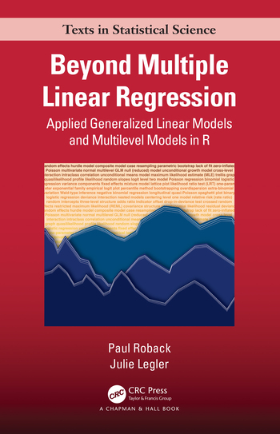

--- 
title: "Beyond Multiple Linear Regression"
subtitle: "Applied Generalized Linear Models and Multilevel Models in R"
author: "Paul Roback and Julie Legler"
date: "`r Sys.Date()`"
documentclass: krantz
bibliography: ["bib/articles.bib", "bib/books.bib", "bib/misc.bib"]
link-citations: yes
colorlinks: yes
site: bookdown::bookdown_site
description: "An applied textbook on generalized linear models and multilevel models for advanced undergraduates, featuring many real, unique data sets.  It is intended to be accessible to undergraduate students who have successfully completed a regression course.  Even though there is no mathematical prerequisite, we still introduce fairly sophisticated topics such as likelihood theory, zero-inflated Poisson, and parametric bootstrapping in an intuitive and applied manner. We believe strongly in case studies featuring real data and real research questions; thus, most of the data in the textbook arises from collaborative research conducted by the authors and their students, or from student projects. Our goal is that, after working through this material, students will develop an expanded toolkit and a greater appreciation for the wider world of data and statistical modeling."
github-repo: proback/BeyondMLR
graphics: yes
cover-image: "data/cover.png"
---

```{r setup, include=FALSE}
library(knitr)

options(
  htmltools.dir.version = FALSE, formatR.indent = 2, width = 55, digits = 4
)

# install the packages needed by this book; you fill out c(), e.g. c('ggplot2', 'dplyr')
# update this &&&
#lapply(c('tidyverse','kableExtra','knitr','gridExtra','GGally','grid'), function(pkg) {
#  if (system.file(package = pkg) == '') install.packages(pkg)
#})
```

# Preface {-}

```{block, include=is_html_output(), purl=FALSE}
Welcome!  This is the [online version](https://bookdown.org/roback/bookdown-BeyondMLR/) of *Beyond Multiple Linear Regression: Applied Generalized Linear Models and Multilevel Models in R*.  Hard copies can be purchased through [CRC Press](https://www.routledge.com/Beyond-Multiple-Linear-Regression-Applied-Generalized-Linear-Models-And/Roback-Legler/p/book/9781439885383) or on [Amazon](https://www.amazon.com/Generalized-Correlated-Methods-Chapman-Statistical/dp/1439885389).  
```

```{r, cover, fig.show='hold', echo=FALSE, out.width='50%'}
if(knitr::is_html_output()){
  }
```

**Beyond Multiple Linear Regression: Applied Generalized Linear Models and Multilevel Models in R** [@RProject] is intended to be accessible to undergraduate students who have successfully completed a regression course through, for example, a textbook like *Stat2* [@Cannon2019]. We started teaching this course at St. Olaf College in 2003 so students would be able to deal with the non-normal, correlated world we live in. It has been offered at St. Olaf every year since. Even though there is no mathematical prerequisite, we still introduce fairly sophisticated topics such as likelihood theory, zero-inflated Poisson, and parametric bootstrapping in an intuitive and applied manner. We believe strongly in case studies featuring real data and real research questions; thus, most of the data in the textbook (and [available at our GitHub repo](https://github.com/proback/BeyondMLR)) arises from collaborative research conducted by the authors and their students, or from student projects. Our goal is that, after working through this material, students will develop an expanded toolkit and a greater appreciation for the wider world of data and statistical modeling.

When we teach this course at St. Olaf, we are able to cover Chapters 1-11 during a single semester, although in order to make time for a large, open-ended group project we sometimes cover some chapters in less depth (e.g., Chapters 3, 7, 10, or 11).  How much you cover will certainly depend on the background of your students (ours have seen both multiple linear and logistic regression), their sophistication level (we have statistical but no mathematical prerequisites), and time available (we have a 14-week semester).  It will also depend on your choice of topics; in our experience, we have found that generalized linear models (GLMs) and multilevel models nicely build on students' previous regression knowledge and allow them to better model data from many real contexts, but we also acknowledge that there are other good choices of topics for an applied "Stat3" course.  The short chapter guide below can help you thread together the material in this book to create the perfect course for you:

- Chapter 1: Review of Multiple Linear Regression.  We've found that our students really benefit from a review in the first week or so, plus in this initial chapter we introduce our approach to exploratory data analysis (EDA) and model building while reminding students about concepts like indicators, interactions, and bootstrapping.
- Chapter 2: Beyond Least Squares: Using Likelihoods.  This chapter builds intuition for likelihoods and their usefulness in testing and estimation; any section involving calculus is optional.  Chapter 2 could be skipped at the risk that later references to likelihoods become more blurry and understanding more shallow.
- Chapter 3: Distribution Theory.  A quick summary of key discrete and continuous probability distributions, this chapter can be used as a reference as needed.
- Chapter 4: Poisson Regression.  This is the most important chapter for generalized linear models, where each of the three case studies introduces new ideas such as coefficient interpretation, Wald-type and drop-in-deviance tests, Wald-type and profile likelihood confidence intervals, offsets, overdispersion, quasilikelihood, zero-inflation, and alternatives like negative binomial.
- Chapter 5: Generalized Linear Models: A Unifying Theory.  Chapter 5 is short, but it importantly shows how linear, logistic, binomial, Poisson, and other regression methods are connected.  We believe it's important that students appreciate that GLMs aren't just a random collection of modeling approaches.
- Chapter 6: Logistic Regression.  We begin with two case studies involving binomial regression, drawing connections with Chapters 4 and 5, before a third case study involving binary logistic regression.
- Chapter 7: Correlated Data.  This is the transition chapter, building intuition about correlated data through an extended simulation and a real case study, although you can jump right to Chapter 8 if you wish.  Chapters 8-11 contain the multilevel model material and, for the most part, they do not depend on earlier chapters (except for generalized responses in Chapter 11 and references to ideas such as likelihoods, inferential approaches, etc.).  In fact, during one semester we taught the multilevel material before the GLM material to facilitate academic civic engagement projects that needed multilevel models (during that semester our order of chapters was: 1, 2, 7, 8, 9, 10, 3, 4, 5, 6, 11).
- Chapter 8: Introduction to Multilevel Models.  As we go through a comprehensive case study, several important ideas are motivated, including EDA for multilevel data, the two-stage approach, multivariate normal distributions, coefficient interpretations, fixed and random effects, random slopes and intercepts, and more.  Another simulation illustrates the effect of inappropriately using regression methods that assume independence for correlated data.
- Chapter 9: Two-Level Longitudinal Data.  This chapter covers the special case of Chapter 8 models where there are multiple measurements over time for each subject.  New topics include longitudinal-specific EDA, missing data methods, parametric bootstrap inference, and covariance structure.
- Chapter 10: Multilevel Data with More Than Two Levels.  The ideas from Chapters 8 and 9 are extended to a three-level case study.  New ideas include boundary constraints and exploding numbers of variance components and fixed effects.
- Chapter 11: Multilevel Generalized Linear Models.  This chapter brings everything together, combining multilevel data with non-normal responses.  Crossed random effects and random effects estimates are both introduced here.

Three types of exercises are available for each chapter.  **Conceptual Exercises** ask about key ideas in the contexts of case studies from the chapter and additional research articles where those ideas appear.  **Guided Exercises** provide real data sets with background descriptions and lead students step-by-step through a set of questions to explore the data, build and interpret models, and address key research questions.  Finally, **Open-Ended Exercises** provide real data sets with contextual descriptions and ask students to explore key questions without prescribing specific steps.  A solutions manual with solutions to all exercises will be available to qualified instructors at our [book’s website](www.routledge.com/Beyond-Multiple-Linear-Regression-Applied-Generalized-Linear-Models-And/Roback-Legler/p/book/9781439885383). 

```{block, include=is_html_output(), purl=FALSE}
## Copyright {-}

© 2021 by Taylor & Francis Group, LLC. Except as permitted under U.S. copyright law, no part of this book may be reprinted, reproduced, transmitted, or utilized in any form by an electronic, mechanical, or other means, now known or hereafter invented, including photocopying, microfilming, and recording, or in any information storage or retrieval system, without written permission from the publishers.
```

<a rel="license" href="http://creativecommons.org/licenses/by-nc-sa/4.0/"></a><br />This work is licensed under a <a rel="license" href="http://creativecommons.org/licenses/by-nc-sa/4.0/">Creative Commons Attribution-NonCommercial-ShareAlike 4.0 International License</a>.

```{block, include=is_html_output(), purl=FALSE}
## About the Authors {-}  

**Paul Roback** is the Kenneth O. Bjork Distinguished Professor of Statistics and Data Science and **Julie Legler** is Professor Emeritus of Statistics at St. Olaf College in Northfield, MN. Both are Fellows of the American Statistical Association and are founders of the Center for Interdisciplinary Research at St. Olaf. Dr. Roback is the past Chair of the ASA Section on Statistical and Data Science Education, conducts applied research using multilevel modeling, text analysis, and Bayesian methods, and has been a statistical consultant in the pharmaceutical, health care, and food processing industries. Dr. Legler is past Chair of the ASA/MAA Joint Committee on Undergraduate Statistics, is a co-author of Stat2: Modelling with Regression and ANOVA, and was a biostatistician at the National Cancer Institute.
```

```{block, include=is_html_output(), purl=FALSE}
## Dedication {-}  

>To our families:

>Karen, Samantha, Timothy, and Sophie

>Paul, Ali, Mark, Sean, Lila, and Eva
```

**Acknowledgments.**  We would like to thank students of Stat 316 at St. Olaf College since 2010 for their patience as this book has taken shape with their feedback.  We would especially like to thank these St. Olaf students for their summer research efforts which significantly improved aspects of this book: Cecilia Noecker, Anna Johanson, Nicole Bettes, Kiegan Rice, Anna Wall, Jack Wolf, Josh Pelayo, Spencer Eanes, and Emily Patterson.  Early editions of this book also benefitted greatly from feedback from instructors who used these materials in their classes, including Matt Beckman, Laura Boehm Vock, Beth Chance, Laura Chihara, Mine Dogucu, and Katie Ziegler-Graham.  Finally, we have appreciated the support of two NSF grants (#DMS-1045015 and #DMS-0354308) and of our colleagues in the Department of Mathematics, Statistics, and Computer Science at St. Olaf.  We are also thankful to Samantha Roback for developing the cover image.

```{r, include=FALSE, eval=FALSE}
# Automatically create a bib database for R packages
knitr::write_bib(c(
  .packages(), 'bookdown', 'knitr', 'rmarkdown', 
  'nycflights13', 'devtools', 'ggplot2', 'webshot', 
  'dygraphs', 'tufte', 'okcupiddata', 'mosaic',
   'dplyr', 'ggplot2movies', 'fivethirtyeight', 'tibble', 'readr'
), 'bib/packages.bib')

#do library AER
```